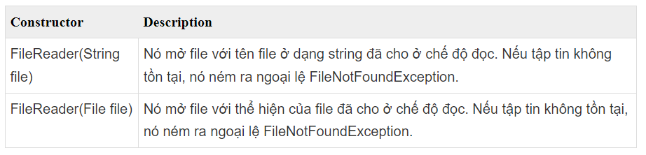
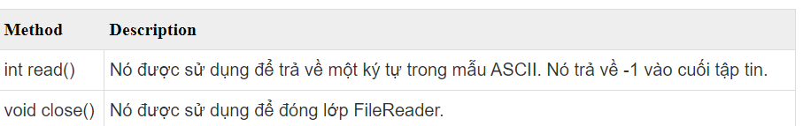
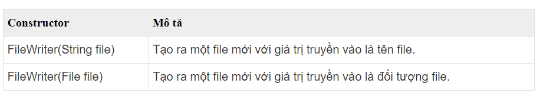
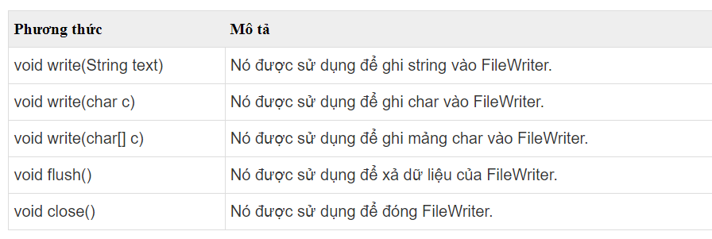
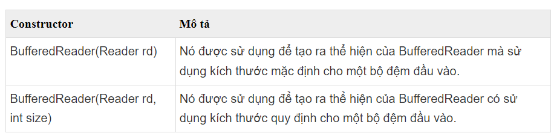
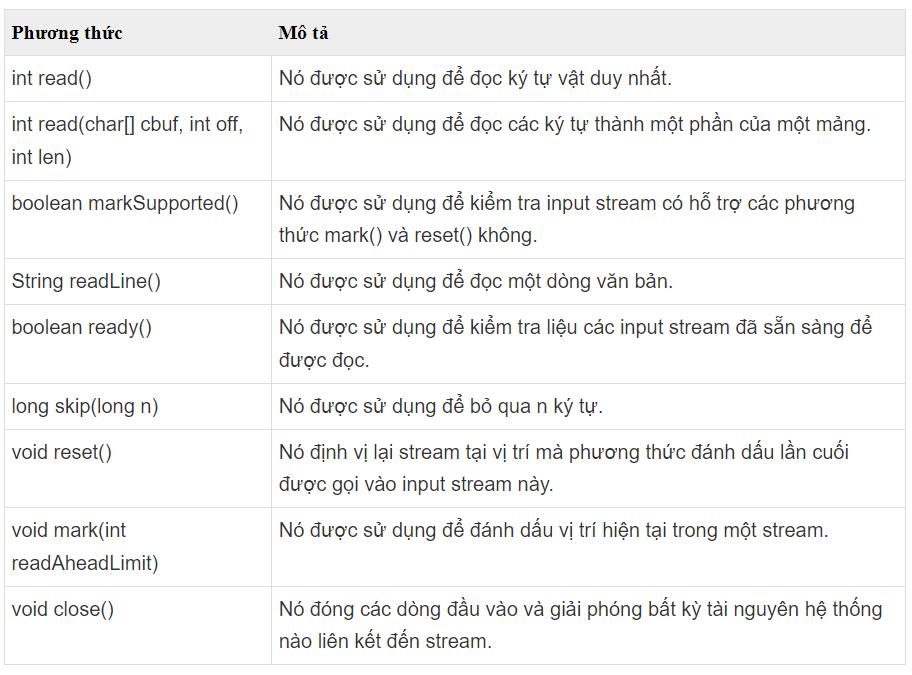
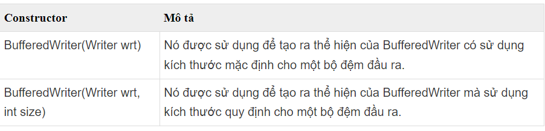
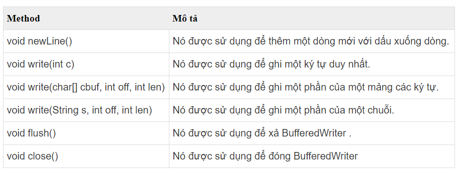

# BUỔI 10: NHẬP XUẤT FILE, UNIT TEST
## I. Nhập xuất file trong Java
- Trong Java, ta có thể xử lý các loại file khác nhau bao gồm cả file văn bản và file nhị phân
### 1. Text File (File văn bản)
#### 1.1 Sủ dụng Character Stream (luồng ký tự)
- Mặc dù có nhiểu lớp liên quan tới Character Stream nhưng các lớp thường dùng nhất là FileReader và Filewriter => hai lớp thường dùng để làm việc với dữ liệu dưới dạng ký tự
- Cú pháp:
  + FileWriter <Tên_Biến> = new FileWriter("<Địa_chỉ_file>"); 
  + FileReader <Tên_Biến> = new FileReader("<Địa_chỉ_file>");
##### 1.1.1 FileReader
- Các constructor của lớp FileReader:

- Các phương thức của lớp FileReader:

- Code basic:
```
package File_Java;

import java.io.FileReader;
import java.io.IOException;

public class Read {
    public static void main(String[] args) {
        try {
            FileReader reader = new FileReader("E:\\Java\\main\\src\\main\\java\\File_Java\\input.txt");
            int character = reader.read();
            while (character != -1) {
                System.out.print((char) character);
                character = reader.read();
            }
            reader.close();
        }
        catch (IOException e) {
             e.printStackTrace();
        }
    }
}
```
##### 1.1.2 FileWriter
- Các constructor của lớp FileWriter:

- Các phương thức của lớp FileWriter:

- Code basic:
```
package File_Java;

import java.io.FileReader;
import java.io.FileWriter;
import java.io.IOException;

public class Write {
    public static void main(String[] args) {
        try {
            FileWriter writer = new FileWriter("E:\\Java\\main\\src\\main\\java\\File_Java\\output.txt");
           writer.write("Hello cac men\n Bye men!");
            writer.close();
        }
        catch (IOException e) {
            e.printStackTrace();
        }
    }
}

```
#### 1.2 Sử dụng buffered stream (luồng đệm)
- Tại sao buffered stream được tạo ra?
    + Hai code trên trên không sử dụng Buffered Streams, điều này có nghĩa là việc đọc và xuất dữ liệu được thực hiện trực tiếp dưới quyền điều khiển của hệ điều hành, gây lãng phí thời gian và tài nguyên. Để giảm thiểu những trên, Buffered Streams đã được sinh ra. 
- Tác dụng:
     + Buffered Streams được sử dụng để tăng tốc độ hoạt động I/O, bằng cách đơn giản là tạo ra một khoảng nhớ đệm với kích thước cụ thể nào đó.
     
=> Vì vậy chúng ta không cần phải truy cập vào ổ đĩa cứng khi thực hiện I/O. Một chương trình có thể chuyển đổi từ không sử dụng buffered stream (Byte Stream và Chracter Stream) sang sử dụng buffered stream bằng việc sử dụng ý tưởng "Wrapping"
##### 1.2.1 Dùng lớp wrapper cho Character Stream (đọc file văn bản)
- Có 2 lớp là:
  + BufferedReader
  + BufferedWriter
###### 1.2.1.1 BufferedReader 
- Các constructor của lớp BufferedReader:

- Các phương thức của lớp BufferedReader:

- Code basic:
```
package File_Java;

import java.io.BufferedReader;
import java.io.FileReader;
import java.io.IOException;

public class Read {
    public static void main(String[] args) {
        try{
            String path = "E:\\Java\\main\\src\\main\\java\\File_Java\\input.txt";
            // Mo file voi FileReader
            FileReader fileReader = new FileReader(path);
            //Su dung BufferedReader de toi uu hieu suat doc
            BufferedReader reader = new BufferedReader(fileReader);
            String line;
            while ((line = reader.readLine()) != null) {
                System.out.println(line);
            }

            // Đóng BufferedReader (Đồng thời cũng sẽ đóng FileReader)
            reader.close();
        }
        catch (IOException e) {
            e.printStackTrace();
        }
    }
}

```
###### 1.2.1.2 BufferedWriter
- Các constructor của lớp BufferedWriter:

- Các phương thức của lớp BufferedWriter:

- Code basic:
```
package File_Java;

import java.io.*;

public class Read {
    public static void main(String[] args) {
        try {
            String path = "E:\\Java\\main\\src\\main\\java\\File_Java\\output.txt";
            // Mở file với FileWriter (nếu file không tồn tại, nó sẽ được tạo mới)
            FileWriter fileWriter = new FileWriter(path);
            // Sử dụng BufferedWriter để tối ưu hiệu suất ghi
            BufferedWriter writer = new BufferedWriter(fileWriter);
            // Dữ liệu bạn muốn ghi vào file
            String data = "Hello, world!\nThis is a text file example.";
            // Ghi dữ liệu vào file
            writer.write(data);
            // Đóng BufferedWriter (Đồng thời cũng sẽ đóng FileWriter)
            writer.close();
            System.out.println("Dữ liệu đã được ghi vào file thành công.");
        }
        catch (IOException e) {
            e.printStackTrace();
        }
    }
}

```
### 2. Binary File (File nhị phân)
#### 2.1 Sử dụng Byte Stream (luồng byte)
- Có rất nhiều class Byte Stream, để hình dung Byte Stream hoạt động như thế nào, chúng ta sẽ tập trung vào FileInputStream và FileOutputStream
##### 2.1.1 FileInputStream
- Code basic: 
```
package File_Java;

import java.io.*;

public class Read {
    public static void main(String[] args) {
        try {
            String path = "E:\\Java\\main\\src\\main\\java\\File_Java\\input.txt";
            FileInputStream fileInputStream = new FileInputStream(path);
            int data;
            // Đọc từng byte từ FileInputStream và in ra màn hình
            while ((data = fileInputStream.read()) != -1) {
                System.out.print((char) data);
            }
            // Đóng FileInputStream
            fileInputStream.close();
        }
        catch (IOException e) {
            e.printStackTrace();
        }
    }
}

```
##### 2.1.2 FileOutputStream
- Code basic:
```
package File_Java;

import java.io.*;

public class Read {
    public static void main(String[] args) {
        try {
            String path = "E:\\Java\\main\\src\\main\\java\\File_Java\\output.txt";
            // Mở FileOutputStream để ghi dữ liệu nhị phân vào file
            FileOutputStream fileOutputStream = new FileOutputStream(path);
            // Dữ liệu nhị phân bạn muốn ghi vào file
            byte[] data = {70, 71, 72, 73, 74, 75};
            // Ghi dữ liệu vào file
            fileOutputStream.write(data);
            // Đóng FileOutputStream
            fileOutputStream.close();
            System.out.println("Dữ liệu đã được ghi vào file nhị phân thành công.");
        }
        catch (IOException e) {
            e.printStackTrace();
        }
    }
}

```
#### 2.2 Sử dụng lớp wrapper cho Byte Stream
- Có 2 lớp:
  + BufferedInputStream
  + BufferedOutputStream
##### 2.2.1 BufferedInputStream
- Code Basic:
```
package File_Java;

import java.io.*;

public class Read {
    public static void main(String[] args) {
        try {
            String path = "E:\\Java\\main\\src\\main\\java\\File_Java\\input.txt";
            FileInputStream fileInputStream = new FileInputStream(path);
            // Tạo BufferedInputStream để tối ưu hiệu suất đọc
            BufferedInputStream bufferedInputStream = new BufferedInputStream(fileInputStream);
            int data;
            // Đọc từng byte từ BufferedInputStream và in ra màn hình
            while ((data = bufferedInputStream.read()) != -1) {
                System.out.print((char)data);
            }
            // Đóng BufferedInputStream (Đồng thời cũng sẽ đóng FileInputStream)
            bufferedInputStream.close();
        }
        catch (IOException e) {
            e.printStackTrace();
        }
    }
}

```
##### 2.2.2 BufferedOutputStream
- Code basic:
```
package File_Java;

import java.io.*;

public class Read {
    public static void main(String[] args) {
        try {
            String path = "E:\\Java\\main\\src\\main\\java\\File_Java\\output.txt";
            // Mở FileOutputStream để ghi dữ liệu nhị phân vào file
            FileOutputStream fileOutputStream = new FileOutputStream(path);
            // Tạo BufferedOutputStream để tối ưu hiệu suất ghi
            BufferedOutputStream bufferedOutputStream = new BufferedOutputStream(fileOutputStream);
            // Dữ liệu nhị phân bạn muốn ghi vào file
            byte[] data = {80, 81, 82, 83, 84, 85};
            // Ghi dữ liệu vào file
            bufferedOutputStream.write(data);
            // Đóng BufferedOutputStream (Đồng thời cũng sẽ đóng FileOutputStream)
            bufferedOutputStream.close();
            System.out.println("Dữ liệu đã được ghi vào file nhị phân thành công.");
        }
        catch (IOException e) {
            e.printStackTrace();
        }
    }
}

```
=>> Note:
- FileReader là lớp cơ bản để đọc dữ liệu từ file văn bản, trong khi BufferedReader cung cấp các tính năng nâng cao như đọc dữ liệu với đệm và đọc dữ liệu theo dòng.
- Nếu bạn cần đọc dữ liệu văn bản từ file một cách cơ bản, bạn có thể sử dụng FileReader. Tuy nhiên, nếu bạn muốn tối ưu hiệu suất đọc, đặc biệt là khi đọc dữ liệu theo dòng, thì việc sử dụng BufferedReader là lựa chọn tốt hơn.
## II. Assertion
### 1. Khái niệm
- Trong Java và nhiều ngôn ngữ lập trình khác, assertions là cách kiểm tra giả định về trạng thái của chương trình tại các điểm cụ thể. Khi một biểu thức kiểm tra không chính xác, assertion sẽ kích hoạt một exception, thường là AssertionError, để báo hiệu rằng có lỗi trong chương trình.

Ví dụ:
```
int x = 5;
assert x == 10 : "Giá trị của x phải là 10";
```
- Trong ví dụ trên, nếu giá trị của biến x không bằng 10, một AssertionError sẽ được kích hoạt và thông báo "Giá trị của x phải là 10" sẽ được hiển thị.
### 2. Tại sao lại cần sử dụng Assertion trong Java
- Assertion được sử dụng bất kỳ khi nào kỹ sư phần mềm muốn kiểm tra tính đúng sai của một vấn đề trong lập trình Java:

  + Để đảm bảo rằng một mã không thể truy cập thực sự không thể truy cập được
  + Để đảm bảo rằng các giá trị giả định được viết trong các nhận xét là đúng
  + Để đảm bảo rằng trường hợp chuyển đổi mặc định không được thực thi
  + Kiểm tra trạng thái của đối tượng
  + Sử dụng tại điểm, bắt đầu của phương thức
### 3. So sánh Java Assertion xử lý ngoại lệ thông thường
- Chúng ta thường sử dụng Assertion để kiểm tra các tình huống bất khả thi về mặt logic. Ví dụ: Chúng ra có thể sử dụng chúng để kiểm tra trạng thái mà mã mong đợi trước khi nó bắt đầu chạy hoặc trạng thái sau khi chạy xong. Sự khác biệt giữa Assertion và ngoại lệ thông thường là các xác nhận thường bị vô hiệu hóa tại thời điểm chạy.
## III. Unit test
- Khi viết ra một đoạn code, ngoài việc để code chạy ra thì chúng ta cần phải đảm bảo nó chạy đúng với ý đồ của mình (đề bài, yêu cầu,…). Mọi người thường dùng cách in từng kết quả ra màn hình và kiểm tra bằng mắt, điều này rất tốn công sức cũng như thời gian. Unit Test ra đời để giúp ta phần nào đơn giản hóa câu chuyện này.

### 1. Unit Test là gì?
- Trong kiểm thử phần mềm có 4 mức độ kiểm thử: Unit test ( kiểm thử mức đơn vị), Intergration test ( kiểm thử tích hợp), System test (kiểm thử hệ thống), Acceptance test (kiểm thử chấp nhận).

- Unit test là mức độ kiểm thử nhỏ nhất trong quy trình kiểm thử phần mềm. Unit test kiểm thử các đơn vị nhỏ nhất trong mã nguồn như method, class, module…Do đó Unit test nhằm kiểm tra mã nguồn của các chương trình, các chức năng riêng rẽ hoạt động đúng hay không.
### 2. Ví dụ đơn giản
- Tạo Một Lớp cần Test:
```
public class Calculator {
    public int add(int a, int b) {
        return a + b;
    }

    public int subtract(int a, int b) {
        return a - b;
    }
}
```
- Viết Unit Tests:
```
import org.junit.Test;
import static org.junit.Assert.assertEquals;

public class CalculatorTest {
    @Test
    public void testAdd() {
        Calculator calculator = new Calculator();
        int result = calculator.add(3, 4);
        assertEquals(7, result);
    }

    @Test
    public void testSubtract() {
        Calculator calculator = new Calculator();
        int result = calculator.subtract(7, 3);
        assertEquals(4, result);
    }
}
```
- Trong ví dụ trên:

  + Chúng ta có một lớp Calculator với hai phương thức add và subtract.
  + Chúng ta viết các unit tests cho mỗi phương thức sử dụng JUnit. Mỗi test case sẽ gọi một phương thức và kiểm tra kết quả bằng phương thức assertEquals để xác nhận xem kết quả được trả về có đúng như mong đợi hay không.
### 3.Công dụng
- **Đảm bảo tính đúng đắn của mã:** Unit test giúp đảm bảo rằng các phần của mã hoạt động chính xác theo như mong đợi. Bằng cách viết các test case, bạn xác định các đầu vào và kỳ vọng đầu ra, từ đó đảm bảo rằng mã của bạn hoạt động đúng trong mọi trường hợp.

- **Phát hiện lỗi sớm:** Viết unit test giúp phát hiện lỗi một cách sớm nhất có thể trong quá trình phát triển. Khi bạn thêm, sửa đổi hoặc loại bỏ mã, việc chạy lại các test case giúp xác định xem các thay đổi có gây ra lỗi hay không.

- **Tăng sự tự tin khi sửa đổi mã:** Khi có một loạt các unit test đầy đủ, bạn có thể sửa đổi mã một cách tự tin mà không phải lo lắng về việc gây ra lỗi trong các phần khác của ứng dụng. Điều này giúp hạn chế các tác động phụ không mong muốn khi thay đổi mã.

- **Hỗ trợ việc bảo trì:** Unit test là một phần không thể thiếu của việc bảo trì phần mềm. Khi bạn thêm tính năng mới, sửa lỗi hoặc thậm chí refactor mã, các unit test giúp đảm bảo rằng các thay đổi này không gây ra lỗi trong các phần khác của hệ thống.

- **Tăng hiệu suất phát triển:** Mặc dù viết và thực thi unit test tốn thêm thời gian và công sức trong giai đoạn phát triển, nhưng nó giúp tiết kiệm thời gian và công sức trong tương lai. Khi bạn phát hiện lỗi sớm và đảm bảo tính đúng đắn của mã, bạn tránh được việc phải dành nhiều thời gian để sửa lỗi sau này.
### 4. Một số khái niệm trong Unit Test

- Dưới đây là một số khái niệm cơ bản và quan trọng trong unit testing mà bạn cần biết:

  + **Test Case (Bộ Test):** Là một tập hợp các đầu vào, điều kiện và kỳ vọng kết quả, được sử dụng để kiểm tra tính đúng đắn của một phần cụ thể của mã.

  + **Assertion (Xác Nhận):** Là một điều kiện hoặc một loạt các điều kiện được sử dụng để kiểm tra tính đúng đắn của kết quả trả về từ một phương thức hoặc hành vi.

  + **Test Fixture (Bộ Thông Tin Test):** Là một môi trường được thiết lập trước để thực thi test cases, bao gồm việc khởi tạo các đối tượng, cài đặt các điều kiện, và chuẩn bị dữ liệu cho việc kiểm tra.

  + **Setup và Teardown:** Là hai phần quan trọng của Test Fixture. Setup là quá trình chuẩn bị môi trường trước khi thực thi mỗi test case, trong khi Teardown là quá trình dọn dẹp và thu dọn môi trường sau khi mỗi test case hoàn thành.

  + **Mocking và Stubbing:** Là các kỹ thuật được sử dụng để tạo ra các đối tượng giả mạo (mock objects) hoặc đối tượng giả (stub objects) để đại diện cho các thành phần phụ thuộc (dependencies) trong test cases, giúp kiểm tra một cách cô lập và độc lập với các thành phần khác của hệ thống.

  + **Test Coverage (Phạm Vi Kiểm Tra):** Là một phép đo để xác định phần trăm của mã nguồn hoặc các thành phần của mã đã được kiểm tra bởi các test cases.

  + **Test Runner (Chương Trình Thực Thi Test):** Là một công cụ hoặc môi trường thực thi test cases và tổ chức và báo cáo kết quả của các test cases.

  + **Unit Test và Integration Test:** Unit test là việc kiểm tra tính đúng đắn của các thành phần cụ thể của mã một cách cô lập, trong khi integration test là việc kiểm tra sự tương tác giữa các thành phần khác nhau của hệ thống.

  + **Test Doubles (Đối Tượng Giả):** Là các đối tượng giả, bao gồm cả stubs, mocks, và dummies, được sử dụng trong unit testing để thay thế các đối tượng thực tế và kiểm tra các phản ứng của mã trong các tình huống khác nhau.

  + **Code Coverage (Phủ Mã Nguồn):** Là phạm vi của mã nguồn mà các test cases kiểm tra. Nó đo lường tỷ lệ phần trăm của mã đã được kiểm tra so với tổng mã nguồn.
### 5. Tầm quan trọng của Unit Test
- **Đảm bảo tính đúng đắn của mã:** Unit test giúp đảm bảo rằng từng phần của mã hoạt động đúng như mong đợi. Bằng cách viết các test case, bạn có thể kiểm tra các phần của mã và đảm bảo rằng chúng đáp ứng các yêu cầu và kỳ vọng đã định sẵn.

- **Phát hiện lỗi sớm:** Viết unit test giúp phát hiện lỗi một cách sớm nhất có thể trong quá trình phát triển. Khi bạn thực thi các test case, bất kỳ lỗi nào xuất hiện trong mã cũng sẽ được phát hiện và báo cáo ngay lập tức, giúp bạn sửa chữa chúng trước khi chúng trở thành vấn đề lớn.

- **Tăng tự tin khi sửa đổi mã:** Có một bộ unit test đầy đủ giúp tăng cảm giác tự tin khi bạn phải sửa đổi mã. Bạn có thể sửa đổi mã một cách tự tin mà không lo lắng về việc gây ra lỗi ẩn trong phần còn lại của ứng dụng.

- **Hỗ trợ việc bảo trì:** Unit test là một phần quan trọng của việc bảo trì phần mềm. Khi bạn thêm tính năng mới, sửa lỗi hoặc thậm chí refactor mã, các unit test giúp đảm bảo rằng các thay đổi này không gây ra lỗi trong các phần khác của hệ thống.

- **Giảm chi phí sửa lỗi:** Viết unit test giúp giảm thiểu số lượng lỗi trong phần mềm. Việc phát hiện và sửa lỗi sớm giúp giảm thiểu chi phí sửa lỗi ở giai đoạn sau của quy trình phát triển.

- **Tăng hiệu suất phát triển:** Mặc dù viết và thực thi unit test tốn thêm thời gian và công sức trong giai đoạn phát triển, nhưng nó giúp tiết kiệm thời gian và công sức trong tương lai. Khi bạn phát hiện lỗi sớm và đảm bảo tính đúng đắn của mã, bạn tránh được việc phải dành nhiều thời gian để sửa lỗi sau này.