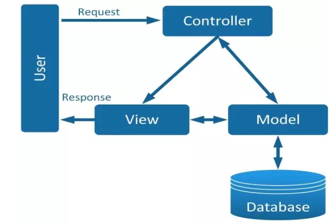

# BUỔI 11: CÁC NGUYÊN TẮC THIẾT KẾ, MÔ HÌNH THIẾT KẾ
## 1. SOLID (3 Phần đầu)
### 1.1. Khái niệm
- Nguyên lý S.O.L.I.D được sinh ra để giúp chúng ta trong quá trình lập trình hướng đối tượng có thể tạo ra được những ứng dụng tốt hơn. Cụ thể là những nguyên tắc này khuyến khích chúng ta tạo được những phần mềm **dễ maintain (duy trì) hơn,** **code dễ hiểu hơn.** Và đồng thời **"mềm dẻo" hơn**. Dẫn tới khi **ứng dụng "phình to",** chúng ta **sẽ giảm thiểu được độ phức tạp.** Đội ngũ phát triển sẽ tốn ít thời gian hơn.
### 1.2. Tên đầy đủ
- Tên đầy đủ của SOLID là:
  + **S**ingle Responsibility : Trách nhiệm đơn lẻ
  + **O**pen/Closed: Mở/Đóng
  + **L**iskov Substitution: Thay thế Liskov
  + **I**nterface Segregation: Phân chia giao diện
  + **D**ependency Inversion: Đảo ngược phụ thuộc
### 1.3. Single Responsibility principle
#### 1.3.1. Nội dung
> Mỗi class chỉ nên chịu trách nhiệm về một nhiệm vụ cụ thể nào đó mà thôi. 
 Không có nhiều hơn một lý do để chỉnh sửa một class.
#### 1.3.2. Ví dụ
```
package File_Java;

import java.util.Scanner;

public class LapTrinhVien {
    private String ten_lap_trinh_vien;

    public void Code() {
        System.out.print("Dang fix bug" + "\n");
    }
    public String In_Hoa(String s) {
        ten_lap_trinh_vien.toUpperCase();
        return ten_lap_trinh_vien;
    }
}

```
- Ta thấy ở class LapTrinhVien trên có 1 phương thức là In_Hoa hoạt động bình thường. Nhưng về mặt logic thì phương thức này lại ko đúng trách nhiệm và nhiệm vụ của class trên. Do đó, phương thức này không thuộc về class này.
- Áp dụng Single Responsibility, thì ta có thể cấu trúc lại code như sau:
```
package File_Java;

import java.util.Scanner;

public class LapTrinhVien {
    private String ten_lap_trinh_vien;

    public void Code() {
        System.out.print("Dang fix bug" + "\n");
    }
}
```
và
```
package File_Java;
public clas VanBan {
    public String In_Hoa(String s) {
        ten_lap_trinh_vien.toUpperCase();
        return ten_lap_trinh_vien;
    }
}
```
- Sau khi cấu trúc lại xong thì code của chúng ta đã dễ hiểu, dành mạch, rõ ràng hơn rất nhiều. Tất nhiên là cũng dễ duy trì hơn nữa.
### 1.4. Open/closed principle
- Đây là một trong những nguyên lý rất quan trọng trong quá trình phát triển phần mềm. Nguyên lý mà chúng ta cần luôn luôn ghi nhớ và áp dụng thường xuyên. Nội dung nguyên lý:

>Chúng ta có thể thoải mái mở rộng class nhưng không được chỉnh sửa nội dung bên trong nó.
- Nguyên lý này nghĩa là: Mỗi khi chúng ta thiết kế một class nào đó thì chúng ta cũng viết làm sao cho sau này, mỗi khi một developer muốn thay đổi luồng trong ứng dụng. Họ chỉ cần thừa kế class ta đã viết hoặc override một hàm nào đó.

- Nếu chúng ta không thiết kế class đủ tốt. Mà do đó những developer khác khi muốn thay đổi luồng của ứng dụng. Họ bắt buộc phải sửa class của chúng ta. Dẫn đến logic của toàn bộ ứng dụng cũng thay đổi theo. Điều này rất gây hại cho quá trình phát triển ứng dụng.
- Một cách để minh họa nguyên lý này là sử dụng lớp trừu tượng và kế thừa.
#### 1.4.1. Ví dụ
```
// Shape.java
// Lớp trừu tượng đại diện cho hình học
public abstract class Shape {
    abstract double area();
}
```
```
// Circle.java
public class Circle extends Shape {
    private double radius;

    public Circle(double radius) {
        this.radius = radius;
    }

    @Override
    double area() {
        return Math.PI * radius * radius;
    }
}
```
```
// Square.java
public class Square extends Shape {
    private double side;

    public Square(double side) {
        this.side = side;
    }

    @Override
    double area() {
        return side * side;
    }
}
```
```
// Main.java
public class Main {
    public static void main(String[] args) {
        Shape circle = new Circle(5);
        Shape square = new Square(4);

        // In diện tích của hình tròn và hình vuông
        System.out.println("Diện tích của hình tròn: " + circle.area());
        System.out.println("Diện tích của hình vuông: " + square.area());
    }
}
```
- Trong ví dụ này, chúng ta có một lớp trừu tượng **Shape** đại diện cho các hình học. Hai lớp con **Circle và Square** mở rộng từ **Shape** và triển khai phương thức **area()** để tính diện tích của hình tròn và hình vuông. Khi chúng ta muốn thêm một loại hình học mới, chẳng hạn như hình chữ nhật, chúng ta có thể tạo một lớp mới mà không cần sửa đổi mã nguồn của các lớp đã có. Điều này tuân thủ nguyên lý ***Open/Closed***.
### 1.5. Liskov Substitution Principle
- Nguyên lý thay thế Liskov (Liskov Substitution Principle - LSP) là một nguyên lý trong lập trình hướng đối tượng, được đặt tên theo Barbara Liskov, một nhà khoa học máy tính nổi tiếng. 
> Trong một chương trình, các object của class con có thể thay thế class cha mà không làm thay đổi tính đúng đắn của chương trình.
#### 1.5.1. Ví dụ
- Bạn có một hệ thống quản lý hình học, trong đó bạn có một lớp cha Shape, và hai lớp con Rectangle và Square. Theo kích thước, một hình vuông là một loại hình chữ nhật, nhưng trong lập trình hướng đối tượng, việc kế thừa chúng lại không phản ánh đúng thực tế.

- Vậy nên, để tuân thủ nguyên lý LSP, bạn cần chia ra làm hai lớp riêng biệt: Rectangle và Square, mỗi lớp có một cách thức hoạt động riêng biệt về diện tích.
```
// Rectangle.java
public class Rectangle {
    protected int width, height;

    public Rectangle(int width, int height) {
        this.width = width;
        this.height = height;
    }

    public int getWidth() {
        return width;
    }

    public void setWidth(int width) {
        this.width = width;
    }

    public int getHeight() {
        return height;
    }

    public void setHeight(int height) {
        this.height = height;
    }

    public int getArea() {
        return width * height;
    }
}
```
```
// Square.java
public class Square extends Rectangle {
    public Square(int size) {
        super(size, size);
    }

    @Override
    public void setWidth(int width) {
        super.setWidth(width);
        super.setHeight(width);
    }

    @Override
    public void setHeight(int height) {
        super.setHeight(height);
        super.setWidth(height);
    }
}
```
```
// Main.java
public class Main {
    static void testRectangle(Rectangle r) {
        int width = r.getWidth();
        r.setHeight(10);

        // Area should be width * 10
        System.out.println("Expected area = " + (width * 10) + ", got " + r.getArea());
    }

    public static void main(String[] args) {
        Rectangle rectangle = new Rectangle(5, 5);
        Rectangle square = new Square(5);

        // Test Rectangle
        testRectangle(rectangle);

        // Test Square (which is actually a Rectangle)
        testRectangle(square);
    }
}
```
- Trong ví dụ này, Rectangle và Square là hai lớp riêng biệt, mỗi lớp có một cách tính diện tích riêng biệt và việc thay thế một Rectangle bằng một Square hoàn toàn hợp lý mà không làm thay đổi hành vi của chương trình, tuân thủ nguyên lý Liskov Substitution.
## 2. KISS, DRY, YAGNI
(Nguồn: https://viblo.asia/p/oop-va-nguyen-tac-solid-kiss-yagni-dry-2oKLnd9a4QO)
### 2.1. KISS
- **Keep It Simple, Stupid - KISS** là nguyên tắc được được đặt ra bởi Kelly Johnson, với ý nghĩa nhấn mạnh tầm quan trọng của sự đơn giản trong các đoạn code. Đoạn code càng đơn giản thì khả năng để đọc và hiểu được đoạn code đó càng nhanh, càng đơn giản càng dễ dàng để bảo trì cũng như thay đổi trong tương lai, việc này sẽ giúp tiết kiệm thời gian hơn rất nhiều.
- Việc giữ cho code được đơn giản nhưng vẫn đáp ứng đầy đủ các nhu cầu nghiệp vụ là một nhiệm vụ đòi hỏi thời gian và công sức để tối giản hoá. Code càng tinh gọn, dễ hiểu thì khả năng áp dụng của nó càng mạnh mẽ.
Những cách để áp dụng **KISS:**

  + Không lạm dụng các design parttern, các thư viện nếu như không cần thiết
  + Phân loại nhỏ bài toán lớn ra thành các bài toán nhỏ hơn để xử lý ➔ làm mọi thứ đơn giản hơn
  + Đặt tên biến, phương thức một cách rõ ràng, dễ đọc
### 2.2. YAGNI
- **You Aren't Gonna Need It - YAGNI** là nguyên tắc chú trọng đến việc không nên làm phức tạp hóa một yêu cầu bằng các giả định trong tương lai. Hay nói cách khác là đừng giả định và xây dựng các chức năng của một phần mềm trước khi cần dùng tới nó.
- Việc giả định các chức năng và code chúng sẽ gây ra rất nhiều sự lãng phí về thời gian, tiền bạc cũng như công sức của team (review code, testing, ...) và đôi khi sẽ không thu lại được gì (Khi chức năng đó trong tương lai không hề cần thiết). Do đó chỉ nên dành thời gian phát triển các chức năng cần thiết ở hiện tại.
- **Lưu ý:** Nguyên tắc này không bao gồm phạm vi các nhiệm vụ cần đề code được clean, dễ thay đổi. Phạm vi của nguyên tắc này **chỉ nói đến các chức năng nghiệp vụ** của phần mềm chứ **không phải các yêu cầu kĩ thuật của phần mềm.** Một source code của phần mềm vẫn cần phải tuân thủ theo các nguyên tắc thiết kế (Clean code, SOLID) để đảm bảo tính linh hoạt cho phần mềm.
### 2.3. DRY
- **Don't Repeat Yourself - DRY** là một nguyên tắc quen thuộc và cốt lõi trong ngành lập trình. Nguyên tắc được xây dựng bởi ***Andrew Hunt và David Thomas*** trong cuốn sách của họ ***The Pragmatic Programmer***, muốn nhấn mạnh đến việc nên tái sử dụng lại code hết mức có thể.
- Nguyên tắc này giúp cho các phần của code ít bị lặp lại hơn, dễ dàng và nhanh chóng thay đổi các đoạn code (chỉ cần thay đổi ở một nơi mà không cần phải thay đổi ở nhiều nơi) từ đó giảm thiểu thời gian phát triển phần mềm.
- Để áp dụng nguyên tắc này thì bất cứ khi nào có một đoạn mã được sử dụng 2 lần ở những nơi khác nhau thì nên đóng gói lại đoạn mã đó (tạo hàm, tạo class, ...) để sau này có thể gọi đến nó để sử dụng lại.
## 3. Mô hình MVC 
(Nguồn: https://viblo.asia/p/tat-tan-tat-ve-mo-hinh-mvc-Rk74avjAJeO)
### 3.1. Khái niệm
- **MVC** là viết tắt của cụm từ **“Model-View-Controller“.**
- Đây là mô hình thiết kế được sử dụng trong kỹ thuật phần mềm.
- **MVC** là một mẫu kiến trúc phần mềm để tạo lập giao diện người dùng trên máy tính.
- **MVC** chia thành ba phần được kết nối với nhau và mỗi thành phần đều có một nhiệm vụ ***riêng*** của nó và ***độc lập*** với các thành phần khác.
- **MVC** cũng được sử dụng rộng rãi trong phát triển ***web***, sự khác biệt được tùy chỉnh liên quan đến sự có mặt của ***server - client.***

### 3.2. Các thành phần trong MVC
#### 3.2.1. Model
- Có nhiệm vụ thao tác với **Database**
- Nó chứa **tất cả các hàm, các phương thức truy vấn trực tiếp** với dữ liệu
- **Controller** sẽ thông qua các hàm, phương thức đó để lấy dữ liệu rồi gửi qua **View**
#### 3.2.2. View
- Là giao diện người dùng **(User Interface)**
- Chứa các thành phần tương tác với người dùng như **menu, button, image, text,...**
- Nơi nhận dữ liệu từ **Controller** và hiển thị
#### 3.2.3. Controller
- Là thành phần ***trung gian*** giữa ***Model*** và ***View***
- Đảm nhận vai trò tiếp nhận yêu cầu từ người dùng, thông qua ***Model*** để ***lấy dữ liệu*** sau đó thông qua ***View*** để ***hiển thị*** cho người dùng
### 3.3. Luồng xử lý
- Luồng xử lý trong **MVC** rất đơn giản thôi, với **web** nó gồm các bước như sau:

  + Đầu tiên là **Request** từ người dùng được gửi từ **client đến server** 
  + Sau đó **Controller** dựa vào yêu cầu của người dùng tiến hành **giao tiếp với Model** để lấy data từ **database**
   + Cuối cùng **Controller** gửi dữ liệu vừa lấy được về **View** và hiển thị ra cho người dùng trên trình duyệt
### 3.4. Tại sao nên dùng mô hình MVC
- **Sự độc lập và phát triển song song:**
  + Vì mỗi thành phần trong MVC có nhiệm vụ ***riêng*** và ***độc lập*** với nhau, nên mỗi developer có thể ***đảm nhiệm một thành phần*** và không ảnh hưởng đến nhau khiến quá trình phát triển diễn ra nhanh chóng, dễ dàng
- **Hỗ trợ bất đồng bộ:**

  + Kỹ thuật bất đồng bộ khiến các ứng dụng được load nhanh hơn đơn giản vì tiến hành chạy nhiều câu lệnh cùng lúc Xem thêm
- **MVC thân thiện với SEO:**

  + Nền tảng MVC hỗ trợ phát triển các trang web thân thiện với SEO. Bằng nền tảng này, bạn có thể dễ dàng phát triển các URL thân thiện với SEO để tạo ra nhiều lượt truy cập hơn.