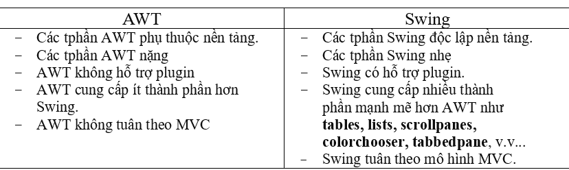
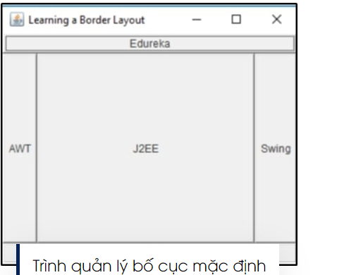
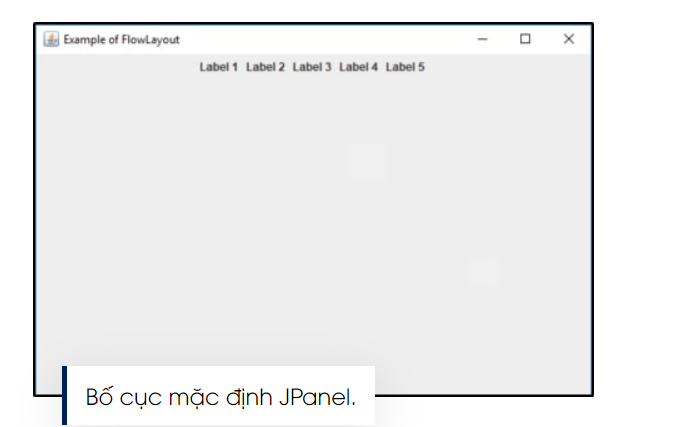
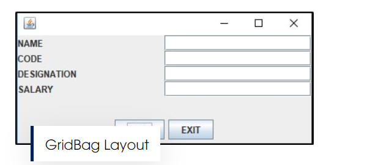

# BUỔI 12: THƯ VIỆN ĐỒ HOAK SWING
## 1. Thư viện đồ hoạ Swing cơ bản
### 1.1. Khái niệm
- **Swing** là thư viện các đối tượng để lập trình giao diện đồ hoạ trong Java. Trước đây thư viện **AWT** là thư viện tiêu chuẩn cho lập trình giao diện, sau này **Swing** được phát triển kế thừa một số lớp của **AWT**, hoạt động nhẹ hơn và độc lập với nền tảng thiết bị, và bổ sung thêm nhiều lớp hiển thị mạnh mẽ hơn.
- Mỗi thành phần trong **Swing** được gọi là ***component***. ***Component*** được chia làm 2 loại:
  + **Loại khung chứa:** là những *component* định nghĩa khung chứa các *component* khác bên trong. Các *component* loại này ko thực hiện chức năng hiển thị nội dung, mà chỉ định nghĩa kích thước, nền, cách sắp xếp và hiển thị các *component* bên trong. Các *component* khung chứa thường dùng như ***JFrame, JPanel, JDialog, …***
  + **Loại hiển thị:** là những *component* đơn vị thực hiện chức năng hiển thị nội dung. Các *component* hiển thị thường dùng như ***JLabel, JButton, JList, JTextField, …***
### 1.2. So sánh AWT và Swing

### 1.3. Cách sử dụng một số component
- Các *component* đều có các phương thức cơ bản sau:

  + **setSize(width, height):** cài đặt kích thước.

  + **setLocation(x, y):** cài đặt vị trí (lấy vị trí góc trên bên trái làm gốc).

  + **setBound(x, y, width, height):** là phương thức ghép chung cả setLocation và setSize.

  + **setBackground(color):** cài đặt màu nền. Có 2 cách truyền tham số màu: hoặc là dùng màu được quy ước sẵn trong lớp Color.
    * ví dụ như “Color.white”, hoặc tạo một đối tượng Color, ví dụ “new Color(255, 0, 0)”. Có nhiều cách truyền tham số để khởi tạo đối tượng Color, các bạn tham khảo thêm.

  + **setForeground(color):** cài đặt màu chữ.

  + **setVisible(boolean):** cài đặt ẩn hay hiện. Thường thì chỉ Frame hay Window bắt buộc phải thiết lập “setVisible(true)”, còn các component khác thì mặc định thiết lập này true rồi.
## 2. JFrame, JButton, JLabel, JTextField, JTable, JList
### 2.1. JFrame: là container cấp cao nhất, dùng để hiển thị lên cửa sổ window
- **setTitle("Title"):** cài đặt tên tiêu đề.
- **setLocationRelativeTo(null):** đặt cho cửa sổ xuất hiện ở giữa màn hình.

- **setResizable(false):** cài đặt ko cho phép kéo thả thay đổi kích thước cửa sổ.
- **setDefaultCloseOperation(DO_NOTHING_ON_CLOSE):** lựa chọn ko làm gì khi bạn nhấn nút đóng cửa sổ (nút chéo đỏ). Bạn có thể đặt giá trị “EXIT_ON_CLOSE” để thoát chương trình khi nhấn nút đóng, tuy nhiên cách này ko nên dùng vì ko phải lúc nào nó cũng thoát hoàn toàn. Cách tốt nhất là chúng ta viết xử lý sự kiện riêng (mình sẽ trình bày sau).

- **setLayout(layout):** cài đặt cách bố trí các component trong container. Về các loại Layout mình sẽ trình bày sau.

- **add(component):** sau khi khởi tạo component thì chúng ta thêm component đó vào container, ví dụ “add(mainPanel)”. Lưu ý phải thêm vào khung chứa thì component đó mới được hiển thị.
- Code mẫu:
```
public class Test{
    public Test() {
        JFrame jFrame = new JFrame("Hello");
        jFrame.setSize(300, 400);//thiết lập kích thước cửa sổ (đơn vị pixel)
        jFrame.setLocationRelativeTo(null);// Hiển thị cửa sổ ở giữa maàn hình
        jFrame.setDefaultCloseOperation(JFrame.EXIT_ON_CLOSE);//Khi ấn nút X sẽ tắt luôn cửa sổ và dừng chương trình
        jFrame.setVisible(true); // Hiển thị cửa sổ
    }

    public static void main(String[] args) {
        Test test = new Test();
    }
}
```
### 2.2. JLabel
- **setText("Số lần bấm: " + count):** đặt nội dung text cần hiển thị.
- **setFont(new Font("VNI", Font.PLAIN, 24)):** cài đặt font.
- **setOpaque(true):** mặc định màu nền của Label là trong suốt, đó là bạn phải cài đặt tính đục bằng true thì phương thức cài đặt màu nền setBackground mới có hiệu lực.
- **setHorizontalAlignment(JLabel.CENTER):** căn text vào giữa Label theo hàng ngang.
- **setVerticalAlignment(JLabel.CENTER):** căn text vào giữa Label theo hàng dọc.
  + *Bạn có thể truyền giá trị JLabel.RIGHT để căn sang lề phải.*
- Code mẫu:
```
public class Test{
    public Test() {
        //Tạo cửa sổ
        JFrame jFrame = new JFrame("Hello");
        jFrame.setSize(300, 400);//thiết lập kích thước cửa sổ (đơn vị pixel)
        // Tạo vùng chứa văn bản
        JLabel jLabel = new JLabel("Xin chào mọi người");
        jLabel.setSize(70, 70);//Thiết lập kích thước vùng văn bản
        jLabel.setHorizontalAlignment(JLabel.CENTER);// Căn text vào giữa Label
        jFrame.add(jLabel);// Thêm Label vào Frame
        //Hiển thị
        jFrame.setLocationRelativeTo(null);// Hiển thị cửa sổ ở giữa maàn hình
        jFrame.setDefaultCloseOperation(JFrame.EXIT_ON_CLOSE);//Khi ấn nút X sẽ tắt luôn cửa sổ và dừng chương trình
        jFrame.setVisible(true); // Hiển thị cửa sổ
    }

    public static void main(String[] args) {
        Test test = new Test();
    }
}
```
### 2.3. JButton
- Dùng để tạo nút **Button** có tên.
- Việc sử dụng **ActionListener** sẽ dẫn đến một số hành động khi nút được nhấn.
- Nó kế thừa lớp **AbstractButton** và độc lập với nền tảng.
- Code mẫu:
```
public class Test{
    public Test() {
        //Tạo cửa sổ
        JFrame jFrame = new JFrame("Hello");
        jFrame.setSize(300, 400);//thiết lập kích thước cửa sổ (đơn vị pixel)
        // Tạo vùng chứa văn bản
        JLabel jLabel = new JLabel("Xin chào mọi người");
        jLabel.setBounds(65, 50, 150, 20);//Thiết lập toạ độ vàkích thước vùng văn bản
        jLabel.setHorizontalAlignment(JLabel.CENTER);// Căn text vào giữa Label
        jFrame.add(jLabel);// Thêm Label vào Frame
        // Tạo nút bấm
        JButton jButton = new JButton("Thanks");
        jButton.setBounds(100, 100, 80,30);// Thiết lập kích thước và toạ độ đặt nút bấm
        jFrame.add(jButton); // Thêm Button vào Frame
        //Hiển thị
        jFrame.setLayout(null); //Không sử dụng trình quản lý bố cục
        jFrame.setLocationRelativeTo(null);// Hiển thị cửa sổ ở giữa maàn hình
        jFrame.setDefaultCloseOperation(JFrame.EXIT_ON_CLOSE);//Khi ấn nút X sẽ tắt luôn cửa sổ và dừng chương trình
        jFrame.setVisible(true); // Hiển thị cửa sổ
    }

    public static void main(String[] args) {
        Test test = new Test();
    }
}
```
### 2.4. JTextField
- Kế thừa lớp JTextComponent và dùng để cho phép chỉnh sửa dòng đơn.
- Code mẫu:
```
public class Test{
    public Test() {
        //Tạo cửa sổ
        JFrame jFrame = new JFrame("Hello");
        jFrame.setSize(300, 400);//thiết lập kích thước cửa sổ (đơn vị pixel)
        // Tạo vùng chứa văn bản
        JLabel jLabel = new JLabel("Xin chào mọi người");
        jLabel.setBounds(55, 40, 150, 20);//Thiết lập toạ độ vàkích thước vùng văn bản
        jLabel.setHorizontalAlignment(JLabel.CENTER);// Căn text vào giữa Label
        jFrame.add(jLabel);// Thêm Label vào Frame
        // Tạo nút bấm
        JButton jButton = new JButton("Thanks");
        jButton.setBounds(100, 100, 80,30);// Thiết lập kích thước và toạ độ đặt nút bấm
        jFrame.add(jButton); // Thêm Button vào Frame
        // Tạo ô nhập
        JTextField jTextField = new JTextField(":))");
        jTextField.setBounds(70, 60, 200, 30); // Thiết lập toạ độ và kích thước ô nhập
        jFrame.add(jTextField); // Thêm vào Frame
        //Hiển thị
        jFrame.setLayout(null); //Không sử dụng trình quản lý bố cục
        jFrame.setLocationRelativeTo(null);// Hiển thị cửa sổ ở giữa maàn hình
        jFrame.setDefaultCloseOperation(JFrame.EXIT_ON_CLOSE);//Khi ấn nút X sẽ tắt luôn cửa sổ và dừng chương trình
        jFrame.setVisible(true); // Hiển thị cửa sổ
    }

    public static void main(String[] args) {
        Test test = new Test();
    }
}
```
### 2.5. JScrollBar - Thanh cuộn
```
public class Test{
    public Test() {
        //Tạo cửa sổ
        JFrame jFrame = new JFrame("Hello");
        jFrame.setSize(300, 400);//thiết lập kích thước cửa sổ (đơn vị pixel)
        // Tạo thanh cuộn
        JScrollBar jScrollBar = new JScrollBar();
        jScrollBar.setBounds(50, 50, 20,200); // Thiết lập toạ độ và giá trị cho thanh cuộn
        jFrame.add(jScrollBar); // Thêm vào Frame;
        //Hiển thị
        jFrame.setLayout(null); //Không sử dụng trình quản lý bố cục
        jFrame.setLocationRelativeTo(null);// Hiển thị cửa sổ ở giữa maàn hình
        jFrame.setDefaultCloseOperation(JFrame.EXIT_ON_CLOSE);//Khi ấn nút X sẽ tắt luôn cửa sổ và dừng chương trình
        jFrame.setVisible(true); // Hiển thị cửa sổ
    }

    public static void main(String[] args) {
        Test test = new Test();
    }
}
```
### 2.6. JTable
- Tạo ra một bảng 2 chiều với tiêu đề và các nội dung.
- Code mẫu:
```
public class Test{
    public Test() {
        //Tạo cửa sổ
        JFrame jFrame = new JFrame("Hello");
        jFrame.setSize(500, 400);//thiết lập kích thước cửa sổ (đơn vị pixel)
        // Tạo Bảng 2 chiều
        String [] Ky_hieu= {"STT", "Name", "Class"};
        String [][] Thong_tin= {{"1", "Kien", "2B"}, {"2", "Long", "2C"}};
        JTable jTable = new JTable(Thong_tin, Ky_hieu);
        JScrollPane jScrollPane = new JScrollPane(jTable); // Hiển thị tiêu đề cột
        jScrollPane.setBounds(50, 50, 200, 200); // Thiểt lập toạ độ và kích thước
        jFrame.add(jScrollPane); // Thêm vào Frame
        //Hiển thị
        jFrame.setLayout(null); //Không sử dụng trình quản lý bố cục
        jFrame.setLocationRelativeTo(null);// Hiển thị cửa sổ ở giữa maàn hình
        jFrame.setDefaultCloseOperation(JFrame.EXIT_ON_CLOSE);//Khi ấn nút X sẽ tắt luôn cửa sổ và dừng chương trình
        jFrame.setVisible(true); // Hiển thị cửa sổ
    }

    public static void main(String[] args) {
        Test test = new Test();
    }
}
```
### 2.7. JList
- Kế thừa lớp JComponent, đối tượng của lớp Jlist đại diện cho danh sách các mục văn bản.
```
public class Test{
    public Test() {
        //Tạo cửa sổ
        JFrame jFrame = new JFrame("Hello");
        jFrame.setSize(500, 400);//thiết lập kích thước cửa sổ (đơn vị pixel)
        // Tạo List
        String[] items = {"item 1", "item 2", "item 3", "item 4"};
        JList<String> jList = new JList<>(items);
        jList.setBounds(50, 50, 200, 200); //Thiết lập toạ độ và kích thước của List
        jFrame.add(jList); // Thêm vào Frame
        //Hiển thị
        jFrame.setLayout(null); //Không sử dụng trình quản lý bố cục
        jFrame.setLocationRelativeTo(null);// Hiển thị cửa sổ ở giữa maàn hình
        jFrame.setDefaultCloseOperation(JFrame.EXIT_ON_CLOSE);//Khi ấn nút X sẽ tắt luôn cửa sổ và dừng chương trình
        jFrame.setVisible(true); // Hiển thị cửa sổ
    }

    public static void main(String[] args) {
        Test test = new Test();
    }
}
```
## 3. BorderLayout, FlowLayout, GridLayout
### 3.1. BorderLayout
- Trình quản lý bố cục mặc định tất cả JFrame là Border Layout.

- Nó đặt các thành phần ở tối đa 5 vị trí: *trên, dưới, trái, phải và trung tâm*
- Border Layout cho phép chỉ định trực tiếp nơi mà một thành phần được đặt. Tuy nhiên khi sử dụng Border Layout, chúng ta chỉ có tối đa 5 vị trí trong một container.

### 3.2. FlowLayout
- Bố cục này đặt các thành phần lần lượt vào một hàng (từ trái qua phải => Nếu không đủ không gian, nó sẽ xuống dòng và tiếp tục bố trí các thành phần từ trái qua phải cho đến khi nào hiển thị hết các thành phần giao diện đồ hoạ).
- Flowlayout Manager tự động căn chỉnh và tự động xếp chồng các thành phần khi không đủ không gian để hiển thị hết. Nó cũng cho phép chỉ định vị trí cụ thể cho các thành phần (left, center, right) trong trường hợp không đủ không gian để hiển thị tất cả các thành phần.
- Flow Layout sử dụng đơn giản, tuy nhiên nếu container bị thay đổi kích cỡ một số thành phần có thể chuyển lên trên hoặc chuyển xuống dưới tuỳ thuộc vào chiều ngang.

### 3.3. GridLayout
- **GridLayout** là một loại **LayoutManager** trong Java Swing được sử dụng để tự động sắp xếp các thành phần (components) của giao diện người dùng trong một lưới có kích thước cố định. Trong một **GridLayout**, các thành phần được xếp theo hàng và cột, tạo thành một lưới có số hàng và số cột được xác định trước.

- Các đặc điểm chính của **GridLayout** bao gồm:

  + ***Sắp xếp đều các thành phần:*** Các thành phần được sắp xếp theo hàng và cột trong lưới, và các ô trong lưới có kích thước bằng nhau.

  + ***Kích thước cố định:*** Kích thước của mỗi ô trong lưới được tính toán dựa trên kích thước của lưới và số lượng hàng và cột được chỉ định.

  + ***Phân bổ không đổi:*** Tất cả các ô trong lưới có kích thước bằng nhau, và không thay đổi dựa trên kích thước của thành phần bên trong.

  + ***Sắp xếp theo thứ tự:*** Thành phần được thêm vào lưới theo thứ tự từ trái sang phải, từ trên xuống dưới.

- Code ví dụ:
```
 public static void main(String[] args) {
        JFrame frame = new JFrame("GridLayout Example");
        frame.setDefaultCloseOperation(JFrame.EXIT_ON_CLOSE);
        frame.setSize(300, 300);

        // Tạo một JPanel với layout là GridLayout
        JPanel panel = new JPanel(new GridLayout(3, 3));

        // Thêm các JButton vào panel
        for (int i = 1; i <= 9; i++) {
            JButton button = new JButton("Button " + i);
            panel.add(button);
        }

        frame.add(panel);
        frame.setVisible(true);
    }
```
- Trong ví dụ này,  tạo một JPanel với GridLayout có 3 hàng và 3 cột, sau đó thêm 9 JButton vào JPanel. Khi hiển thị cửa sổ, các nút sẽ được tự động sắp xếp thành một lưới 3x3.
## 4. Graphics2D, Image
### 4.1. Graphics2D
- Là lớp trừu tượng kế thừa từ lớp Graphics, hỗ trợ nhiều công cụ để vẽ và xuất ra hình ảnh, văn bản… trên hình dạng 2 chiều
- Được sử dụng trong việc ghi đè phương thức paint(đối với container) và paintComponent(đối với component). Khi này ta có thể thiết kế để thành phần nhìn đẹp mắt hơn
- Dưới đây là một số phương thức được sử dụng phổ biến của lớp Graphics:

  + **public abstract void drawString(String str, int x, int y):** được sử dụng để vẽ chuỗi đã cho.

  + **public void drawRect(int x, int y, int width, int height):** vẽ một hình chữ nhật với độ rộng width và chiều cao height đã cho.

  + **public abstract void fillRect(int x, int y, int width, int height):** được sử dụng để điền màu mặc định và độ rộng và chiều cao đã cho vào hình chữ nhật.

  + **public abstract void drawOval(int x, int y, int width, int height):** được sử dụng để vẽ hình Ovan với độ rộng và chiều cao đã cho.

  + **public abstract void fillOval(int x, int y, int width, int height):** được sử dụng để điền màu mặc định và độ rộng và chiều cao đã cho vào hình Oval.

  + **public abstract void drawLine(int x1, int y1, int x2, int y2):** được sử dụng để vẽ line giữa hai điểm có tọa độ lần lượt là (x1, y1) và (x2, y2).

  + **public abstract boolean drawImage(Image img, int x, int y, ImageObserver observer):** được sử dụng để vẽ hình ảnh đã cho.

  + **public abstract void drawArc(int x, int y, int width, int height, int startAngle, int arcAngle):** được sử dụng để vẽ đường tròn circular hoặc elip.

  + **public abstract void fillArc(int x, int y, int width, int height, int startAngle, int arcAngle):** được sử dụng để điền một hình tròn hoặc elip.

  + **public abstract void setColor(Color c):** được sử dụng để thiết lập màu hiện tại của đồ họa thành màu color đã cho.

  + **public abstract void setFont(Font font):** được sử dụng để thiết lập font hiện tại của đồ họa thành font đã cho.
### 4.2. Image
- Là lớp trừu tượng cha cho tất cả các lớp dùng để hiển thị hình ảnh.
- Có hai lớp chính là BufferedImage và ImageIcon được sử dụng phổ biến khi làm việc với Image:

  + **BufferedImage:** Là một lớp con của **Image** và được sử dụng để xử lý hình ảnh raster. Nó hỗ trợ nhiều định dạng hình ảnh như JPEG, PNG, BMP, và GIF.

  + **ImageIcon:** Là một lớp con của **Image** được sử dụng chủ yếu để hiển thị hình ảnh trong các thành phần giao diện người dùng như *JLabel, JButton, và JPanel.*
- Code mẫu:
```
public class Test{
    public static void main(String[] args) {
        JFrame frame = new JFrame("Image Example");
        frame.setDefaultCloseOperation(JFrame.EXIT_ON_CLOSE);
        // Tải hình ảnh từ tệp tin
        ImageIcon icon = new ImageIcon("E:\\hello.jpg"); // Thay "path_to_image.jpg" bằng đường dẫn đến tệp hình ảnh
        // Tạo một JLabel để hiển thị hình ảnh
        JLabel label = new JLabel();
        label.setIcon(icon);
        label.setBounds(0, 0, 1280, 1000);
        // Thêm JLabel vào JFrame
        frame.add(label);
        // Cài đặt kích thước cửa sổ
        frame.setSize(1280, 1000);
        // Hiển thị cửa sổ
        frame.setLayout(null);
        frame.setDefaultCloseOperation(JFrame.EXIT_ON_CLOSE);
        frame.setVisible(true);
    }
}
```