# Một số cấu trúc dữ liệu thường thấy trong Java
### 1.Cấu trúc dữ liệu là gì, sử dụng khi nào?
- Trong **khoa học máy tính, cấu trúc dữ liệu** là một cách lưu dữ liệu trong máy tính sao cho nó có thể được sử dụng một cách hiệu quả.
- Dưới đây là một số cấu trúc dữ liệu phổ biến:
  + **Mảng (Array)**
  + **Danh sách liên kết (Linked List)**
  + **Cây (Tree)**
  + **Hàng đợi (C++: queue, deque, priority queue)**
  + **Ngăn xếp (stack)**
  + **Map and Set**
- Mỗi cấu trúc dữ liệu đều có ứng dụng khác nhau. Do vậy, tùy thuộc vào mục đích để sử dụng cấu trúc dữ liệu một cách tối ưu và hợp lý.
### 2.Interface Iterable, Interface Collection
##### 2.1 Interface Collection
- **Collection** là một interface trong Java, nằm trong gói **java.util**.
- **Collection** trong java là một **root interface** trong hệ thống cấp bậc Collection. **Java Collection** cung cấp nhiều interface (Set, List, Queue, Deque vv) và các lớp (ArrayList, Vector, LinkedList, PriorityQueue, HashSet, LinkedHashSet, TreeSet vv).
- 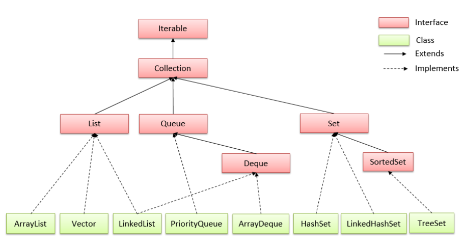
###### 2.1.1 Interface List:
-**List** là một interface trong Java, mô tả một dãy (sequence) các phần tử có thứ tự và có thể chứa các phần tử trùng lặp.
-Các lớp cài đặt List phổ biến: **ArrayList, LinkedList, Vector, Stack**.
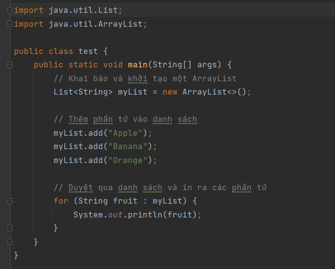
###### 2.1.2 Interface Set:
- **Set** là một interface trong Java, mô tả một tập hợp không có thứ tự các phần tử và không chấp nhận các phần tử trùng lặp.
- Các lớp cài đặt Set phổ biến: **HashSet, LinkedHashSet, TreeSet**:
  + **HashSet:** sử dụng bảng băm để lưu trữ các phần tử và không đảm bảo thứ tự của chúng.
    * Các phần tử không được phép trùng lặp. 
  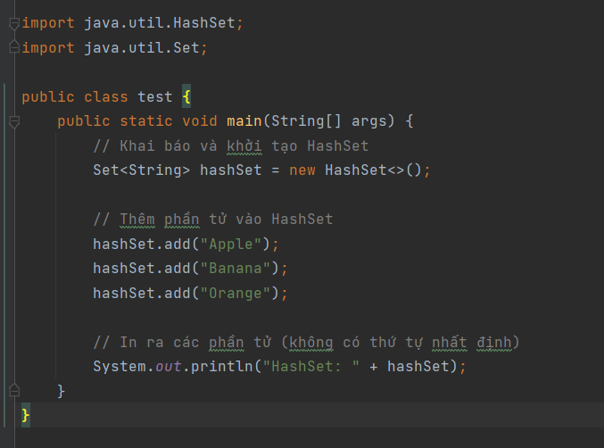 
  + **LinkedHashSet:** kế thừa từ **HashSet** và duy trì thứ tự của các phần tử theo thứ tự chúng được thêm vào.
     * Các phần tử không được phép trùng lặp.
  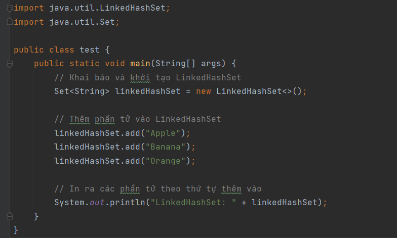
  + **TreeSet: ** sắp xếp các phần tử theo thứ tự tăng dần hoặc giảm dần (tùy thuộc vào so sánh của phần tử).
    * Các phần tử không được phép trùng lặp. 
  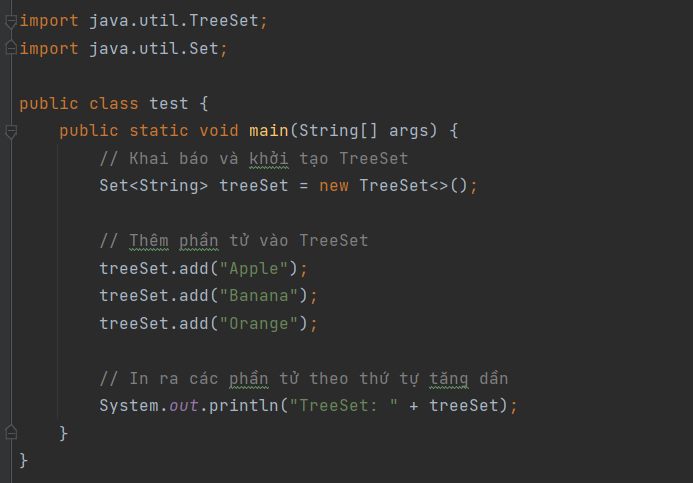
###### 2.1.3  Interface Queue:
- **Queue** là một interface trong Java, mô tả một hàng đợi theo nguyên tắc **_"First In, First Out" (FIFO)_**.
- Các lớp cài đặt Queue phổ biến: **LinkedList, PriorityQueue, ArrayDeque**:
    + **LinkedList:** là một lớp cài đặt của Queue và cung cấp một hàng đợi theo nguyên tắc "First In, First Out" (FIFO).
      * Được xây dựng trên cơ sở của danh sách liên kết.
   
   + **PriorityQueue** là một lớp cài đặt của **_Queue_** và cung cấp hàng đợi ưu tiên, trong đó các phần tử được lấy ra dựa trên độ ưu tiên của chúng.
      * Được xây dựng dựa trên heap.
  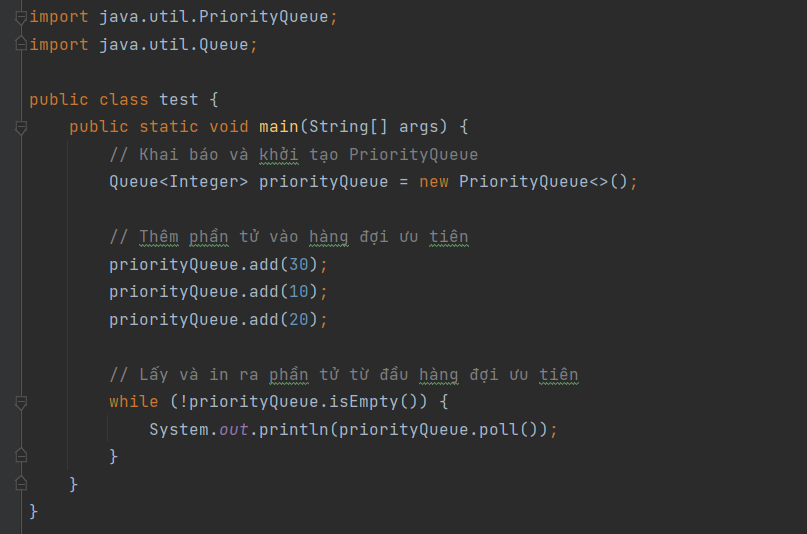
  + **ArrayDeque:** là một lớp cài đặt của **Deque (Double-ended queue)**, cung cấp một hàng đợi có thể được sử dụng theo cả hai chiều (đầu và đuôi).
    * Các phần tử có thể được thêm vào hoặc lấy ra từ cả đầu và đuôi của hàng đợi.
  
### 3.Interface Map, SortedMap
- **Map (đồ thị/ánh xạ)** là kiểu dữ liệu cho phép ta quản lý dữ liệu theo dạng cặp _key-value_, trong đó key là duy nhất và tương ứng với _1 key_ là một giá trị _value_.
- **Interface Map** cung cấp cho ta các phương thức để tương tác với kiểu dữ liệu như vậy. Không giống như các interface ở trên, **Interface Map** không kế thừa từ  **Interface Collection** mà đây là 1 interface độc lập với các phương thức của riêng mình.
- là một interface trong Java, nằm trong gói **java.util**.
  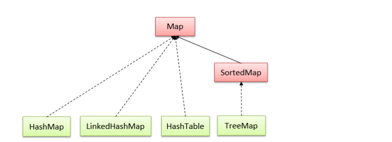
- Các lớp cài đặt Map phổ biến là: **TreeMap, HashMap, LinkedHashMap, WeakHashMap:**
  + **HashMap** là một lớp cài đặt của Map sử dụng bảng băm để lưu trữ các cặp khóa-giá trị.
    * Nó cung cấp thời gian truy cập và thao tác gần như là O(1) trong trường hợp trung bình.
  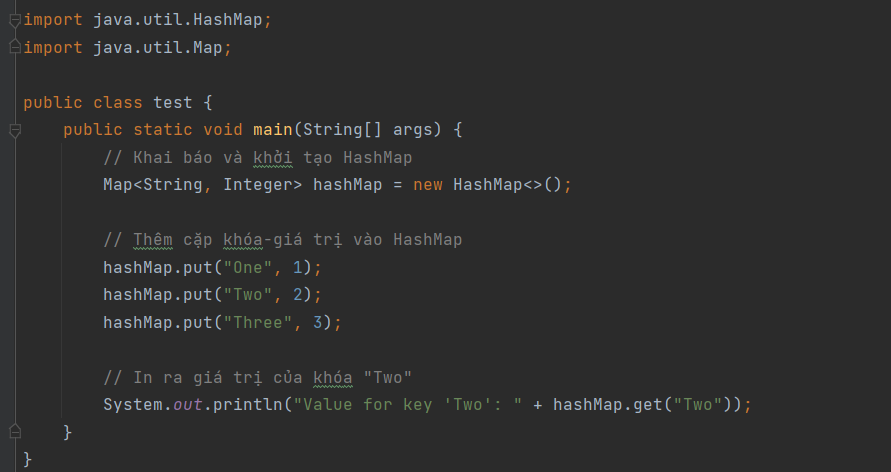
  + **TreeMap** là một lớp cài đặt của **SortedMap**, sử dụng cây đỏ-đen để lưu trữ các cặp khóa-giá trị.
    * Phần tử trong **TreeMap** được sắp xếp theo thứ tự tăng dần của khóa.
  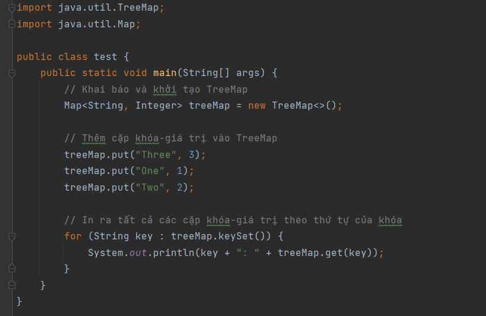
  + **LinkedHashMap** là một lớp cài đặt của Map, kế thừa từ **HashMap** và duy trì thứ tự của các cặp khóa-giá trị.
    * Thứ tự được duy trì dựa trên thời điểm thêm vào hoặc truy cập.
  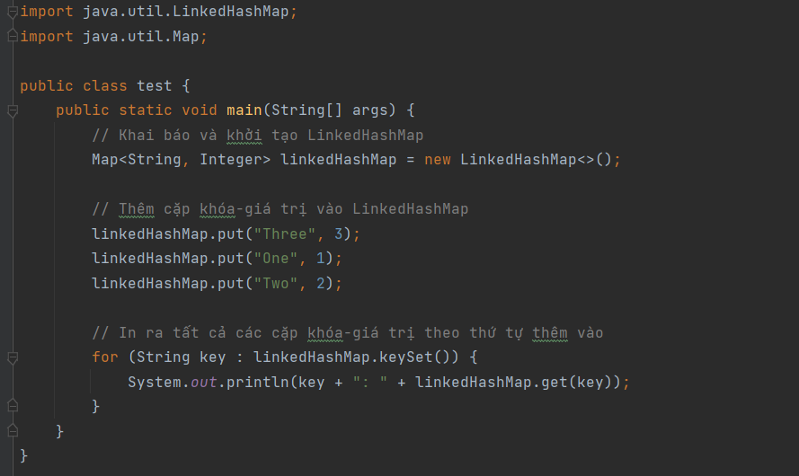
  + **WeakHashMap** là một lớp cài đặt của Map, sử dụng tham chiếu yếu (weak references) cho khóa.
    * Các khóa trong **WeakHashMap** có thể bị thu gọn nếu không còn được sử dụng ở nơi khác.
  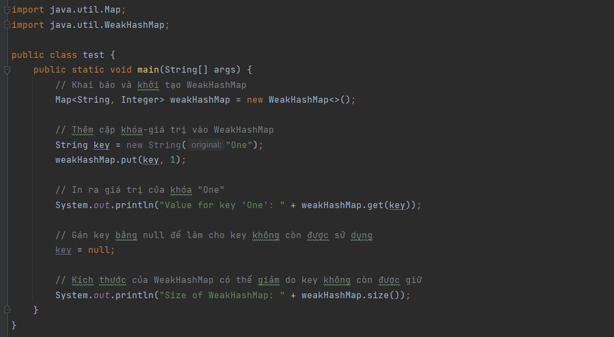
###### 3.1 Interface SortedMap
-**Interface SortedMap:** kế thừa từ **Interface Map** nhưng được phép tùy chỉnh việc sắp xếp cặp key-value theo comparator
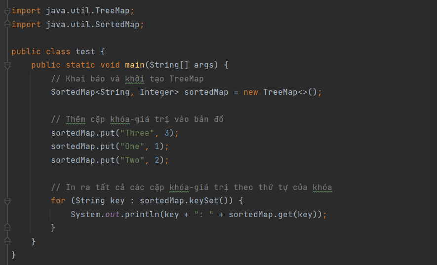
### 4. Sort
###### 4.1 Sử dụng Hàm Sắp Xếp Có Sẵn
- Các lớp **Collections** và **Arrays** trong gói **java.util** cung cấp các phương thức sắp xếp có sẵn mà bạn có thể sử dụng. Dưới đây là một ví dụ với **Collections.sort()** và **Arrays.sort():**
    + Sắp xếp List sử dụng **Collections.sort()**.
  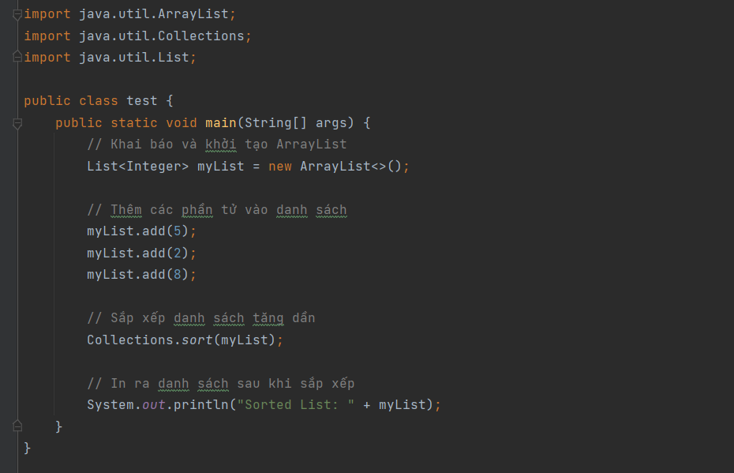
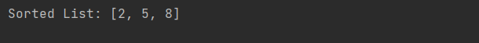
    + Sắp xếp Array sử dụng **Arrays.sort()**.
  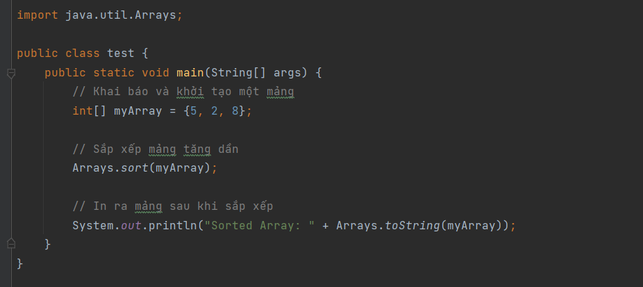
  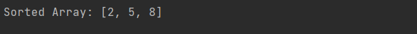
###### 4.2 Sort theo điều kiện 
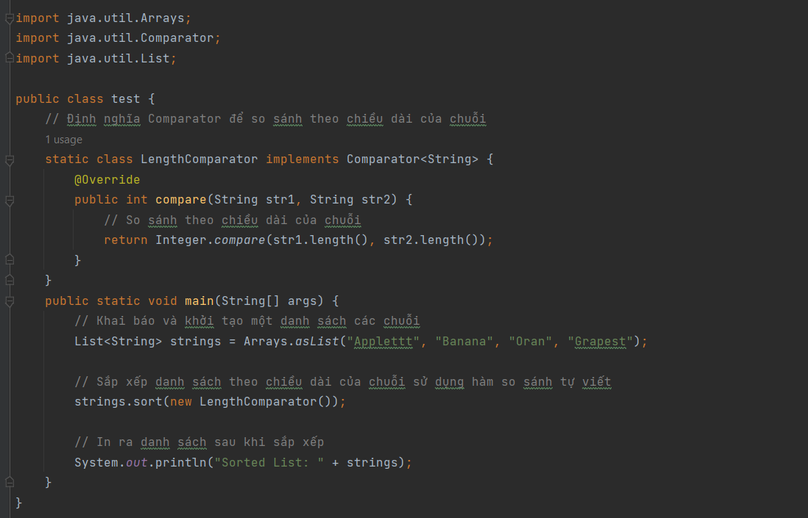
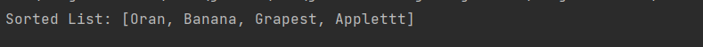
- Trong ví dụ trên, một danh sách các chuỗi và muốn sắp xếp danh sách này theo chiều dài của mỗi chuỗi. Ta tự định nghĩa một Comparator là LengthComparator và truyền nó vào phương thức sort() của danh sách.

- Hàm so sánh compare trong LengthComparator xác định cách so sánh giữa hai chuỗi dựa trên chiều dài của chúng. Kết quả của việc sắp xếp sẽ là danh sách các chuỗi được sắp xếp theo chiều dài từ ngắn đến dài.