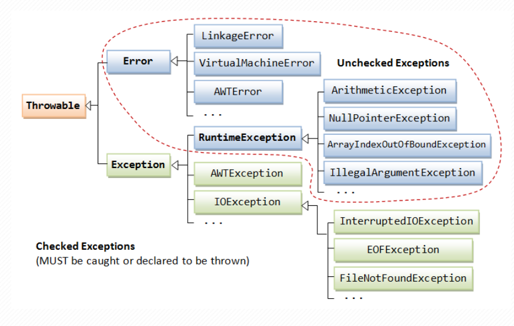
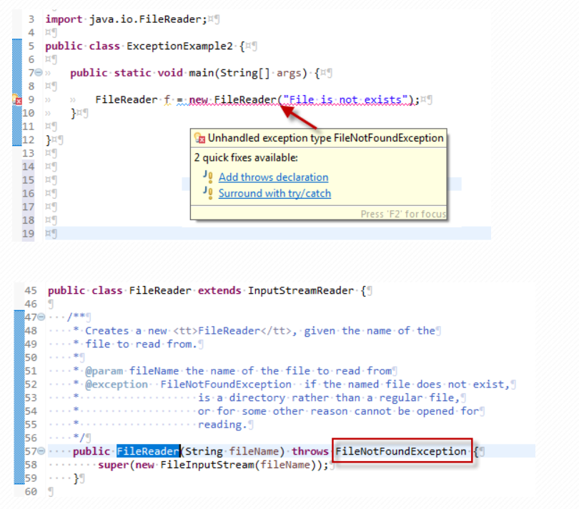
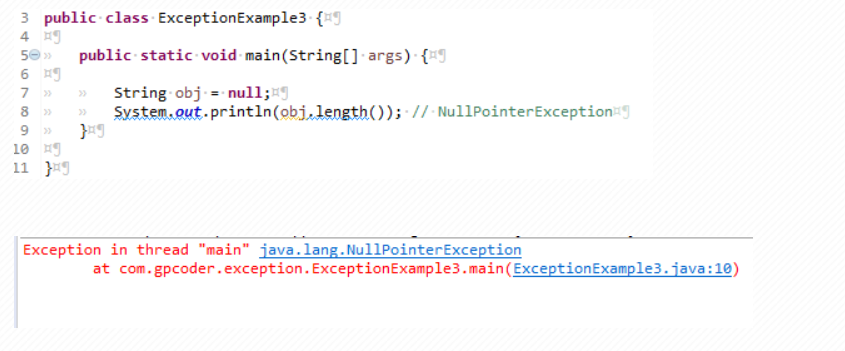
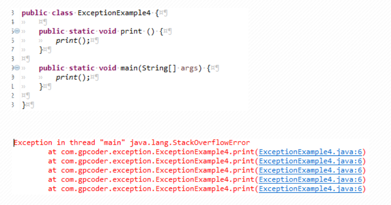
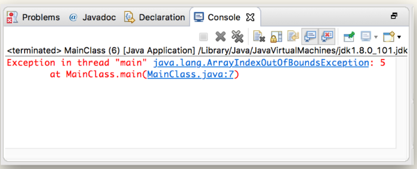
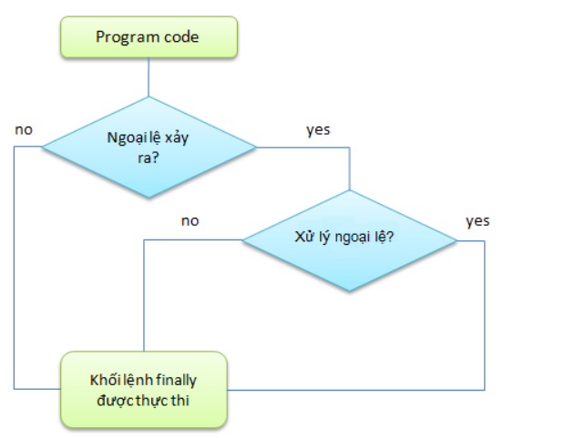
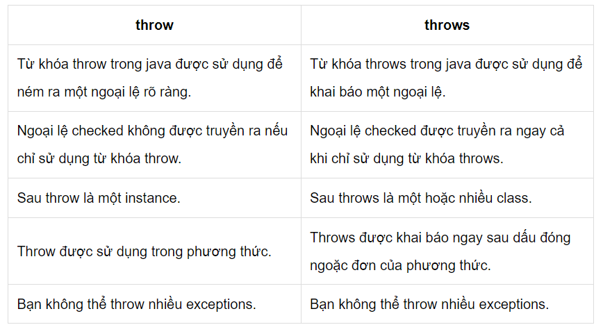

#Buổi 9: Luôn có ngoại lệ, xử lí ngoại lệ
## 1. Exception (Ngoại lệ)
#### 1.1. Exception là gì?
- Exception là một sự kiện xảy ra trong quá trình thực thi một chương trình Java, nó làm phá vỡ cái flow (luồng xử lý) bình thường của một chương trình, thậm chí chết chương trình.

- Một ngoại lệ có thể xảy ra với nhiều lý do khác nhau, nó nằm ngoài dự tính của chương trình. Một vài ngoại lệ xảy ra bởi lỗi của người dùng, một số khác bởi lỗi của lập trình viên và số khác nữa đến từ lỗi của nguồn dữ liệu vật lý. Chẳng hạn như:

  + Người dùng nhập dữ liệu không hợp lệ.
  + Truy cập ngoài chỉ số mảng.
  + Một file cần được mở nhưng không thể tìm thấy.
  + Kết nối mạng bị ngắt trong quá trình thực hiện giao tiếp hoặc JVM hết bộ nhớ.
  ….
- Ví dụ chương trình chia 2 số. Nếu ta cho mẫu số = 0 thì phát sinh lỗi và đó được coi là 1 ngoại lệ.

```
public class ExceptionExample1 {
 
    public static void main(String[] args) {
 
        int zero = 0;
 
        int average = 10 / zero;
 
        System.out.println("Average = " + average);
 
    }
}
```
- Khi thực thi chương trên, sẽ nhận được thông báo lỗi như sau:
```
Exception in thread "main" java.lang.ArithmeticException: / by zero
```
#### 1.2. Hệ thống cấp bậc của các lớp ngoại lệ trong Java
- Đây là mô hình sơ đồ phân cấp của Exception trong java.
  +  Class ở mức cao nhất là Throwable
   + Hai class con trực tiếp là Error và Exception.
- Trong nhánh Exception có một nhánh con RuntimeException là các ngoại lệ sẽ không được java kiểm tra trong thời điểm biên dịch.Ý nghĩa của được kiểm tra và không được kiểm tra tại thời điểm biên dịch sẽ được minh họa trong các ví dụ phần sau.


#### 1.3. Phân loại Exception
- Trong Java có 2 loại exception: **checked**  và **unchecked**. Tất cả các checked exception được kế thừa từ lớp Exception ngoại trừ lớp **RuntimeException.** **RuntimeException** là lớp cơ sở của tất cả các lớp unchecked exception. Đó cũng là dấu hiệu để nhận biết đâu là checked exception và đâu là unchecked exception.

- Điểm khác biệt giữa các lớp checked và unchecked expcetion chính là thời điểm xác định được expcetion có thể xảy ra.
###### 1.3.1. Checked Exception
- **Khái niệm:** *Là loại exception xảy ra trong lúc compile time, nó cũng có thể được gọi là compile time exceptions. Loại exception này không thể bỏ qua được trong quá trình compile, bắt buộc ta phải handle nó.*

- Các lớp extends từ lớp Throwable ngoại trừ RuntimeException và Error được gọi là checked exception.

- Ví dụ: IOException, FileNotFoundException, NoSuchFieldException, ….

- Ví dụ chương trình sau đọc file sử dụng java.io.FileReader lớp này ném ra ngoại lệ FileNotFoundException. Trình biên dịch thông báo lỗi như sau:

###### 1.3.2.UnChecked Exception
- **Khái niệm:** *Là loại exception xảy ra tại thời điểm thực thi chương trình, nó cũng có thể gọi là runtime exceptions đó là programming bugs, lỗi logic của chương trình… Loại exception này được bỏ qua trong quá trình compile, không bắt buộc ta phải handle nó.*

-Các lớp extends từ RuntimeException được gọi là unchecked exception.

-Ví dụ: NullPointerException, NumberFormatException, ArrayIndexOutOfBoundsException, DivideByZeroException, …

-Ví dụ một biến có giá trị null, thực hiện bất kỳ hoạt động nào bởi biến đó sẽ xảy ra ngoại lệ NullPointerException.

#### 1.4. Error
- Error là những vấn đề nghiêm trọng liên quan đến môi trường thực thi của ứng dụng hoặc hệ thống mà lập trình viên không thể kiểm soát. Nó thường làm chết chương trình.

- Lớp Error định nghĩa các ngoại lệ mà không thể bắt (catch) từ chương trình.

- Ví dụ: OutOfMemoryError, VirtualMachineError, and StackOverflowError, …

- Ví dụ chương trình đệ quy vô tận:

## 2. Bắt Exception với try-catch
#### 2.1. Try-catch
- **Try catch** là một công cụ giúp bạn bao bọc lấy đoạn code có khả năng xảy ra Exception. Hoặc các đoạn code đã được báo lỗi bởi hệ thống (chính là các *Checked Exception*). Các đoạn code mình nói đến này sẽ được chúng ta bao trong khối ***try***. Để rồi nếu quả thực cái Exception đó xảy ra trong khối ***try*** đó, thì hệ thống sẽ nhanh chóng “bẻ” luồng logic của ứng dụng, chuyển sang thực thi các đoạn code bên trong khối ***catch***.

- Dựa vào lý giải trên đây, mời bạn cùng xem qua cú pháp cho ***try catch*** như sau.
```
try {
	// Các dòng code có khả năng gây ra Exception
} 
catch (ExceptionClass e) {
	// Nếu thực sực Exception xảy ra, các dòng code này sẽ được gọi
}
```
- Ví dụ: Cho mảng number có 4 phần tử và tìm phần tử thứ 5 của mảng number
```
int num[] = {1, 2, 3, 4};
System.out.println(num[5]);
```
>> Code trên  rơi vào một Unchecked Exception, tức là trình biên dịch sẽ không nhận biết và kiểm tra giúp bạn liệu Exception có xảy ra hay không.


- Hãy bao đoạn có khả năng gây ra lỗi bằng khối try catch như sau.
 ```
try {
    int num[] = {1, 2, 3, 4};
    System.out.println(num[5]);
} 
catch (ArrayIndexOutOfBoundsException e) {
    System.out.println("Không thể in được vì không tìm thấy phần tử mảng như mong đợi.");
}
 ```
 >> Khi này, nếu bạn thực thi lại ứng dụng, người dùng sẽ dễ hiểu hơn với kiểu thông báo lỗi mang “tính người” hơn như sau.
 

 ## 3. Finally
 - Khối lệnh finally trong java được sử dụng để thực thi các lệnh quan trọng như đóng kết nối, đóng cá stream,...

- Khối lệnh finally trong java luôn được thực thi cho dù có ngoại lệ xảy ra hay không hoặc gặp lệnh return trong khối try.

- Khối lệnh finally trong java được khai báo sau khối lệnh try hoặc sau khối lệnh catch.

#### 3.1. Tại sao phải sử dụng khối finally
- Khối finally có thể được sử dụng để chèn lệnh "cleanup" vào chương trình như việc đóng file, đóng các kết nối,...
#### 3.2. Cách sử dụng khối finally trong java
- Dưới đây là các trường hợp khác nhau về việc sử dụng khối finally trong java.
-  TH1: sử dụng khối lệnh finally nơi ngoại lệ không xảy ra.
```
public class TestFinallyBlock {
    public static void main(String args[]) {
        try {
            int data = 25 / 5;
            System.out.println(data);
        } catch (NullPointerException e) {
            System.out.println(e);
        } finally {
            System.out.println("finally block is always executed");
        }
        System.out.println("rest of the code...");
    }
}
```
> output:
```
5
finally block is always executed
rest of the code...
```
- TH2: sử dụng khối lệnh finally nơi ngoại lệ xảy ra nhưng không xử lý.
```
public class TestFinallyBlock1 {
    public static void main(String args[]) {
        try {
            int data = 25 / 0;
            System.out.println(data);
        } catch (NullPointerException e) {
            System.out.println(e);
        } finally {
            System.out.println("finally block is always executed");
        }
        System.out.println("rest of the code...");
    }
}
```
> output:
```
finally block is always executed
Exception in thread "main" java.lang.ArithmeticException: / by zero
```
- TH3: sử dụng khối lệnh finally nơi ngoại lệ xảy ra và được xử lý.
```
public class TestFinallyBlock2 {
    public static void main(String args[]) {
        try {
            int data = 25 / 0;
            System.out.println(data);
        } catch (ArithmeticException e) {
            System.out.println(e);
        } finally {
            System.out.println("finally block is always executed");
        }
        System.out.println("rest of the code...");
    }
}
```
> output: 
```
java.lang.ArithmeticException: / by zero
finally block is always executed
rest of the code...
```
- TH4: sử dụng khối lệnh finally trong trường hợp trong khối try có lệnh return.
```
public class TestFinallyBlock3 {
    public static void main(String args[]) {
        try {
            int data = 25;
            if (data % 2 != 0) {
             System.out.println(data + " is odd number");
             return;
            }
        } catch (ArithmeticException e) {
            System.out.println(e);
        } finally {
            System.out.println("finally block is always executed");
        }
        System.out.println("rest of the code...");
    }
}
```
> output:
```
25 is odd number
finally block is always executed
```
## 5. Throw và Throws
#### 5.1. Throws
- Nếu một phương thức không xử lý một ngoại lệ đã kiểm tra thì phương thức đó phải khai báo ngoại lệ bằng từ khóa throws. Từ khóa throws được khai báo ở cuối dấu ngoặc ( ) trước khi bắt đầu một phương thức.

- Cùng xem ví dụ về cách sử dụng throws
```
import java.io.*;
public class DemoJava {
    public static void main(String[] args) throws IOException {
       FileOutputStream fileOutputStream = null;
       fileOutputStream = new FileOutputStream("D://output.txt");
       fileOutputStream.write(65);
    }
}
```
> Ở ví dụ trên phương thức main đã khai báo bỏ qua ngoại lệ IOException nên chương trình trên vẫn chạy bình thường.

## 5.2. Throw
- Từ khóa throw dùng để ném ra một ngoại lệ cụ thể.

- Chúng ta có thể ném một trong hai ngoại lệ checked hoặc unchecked trong java bằng từ khóa *throw*. Từ khóa throw chủ yếu được sử dụng để ném ngoại lệ tùy chỉnh (ngoại lệ do người dùng tự định nghĩa).

- Cú pháp từ khóa throw:
```
throw exception ;
```
- Ví dụ về ném ra ngoại lệ IOException:
```
throw new IOException("File khong ton tai") ;
Cùng xem cách ném ra ngoại lệ bằng từ khóa throw

import java.io.*;
public class DemoJava {
    static void demoThrow ()throws IOException{
        throw new IOException("File khong ton tai");
    }
    public static void main(String[] args) throws IOException {
    demoThrow();
    }

}
```
> Sau khi chạy chúng ta sẽ nhận được kết quả:

```
Exception in thread "main" java.io.IOException: File khong ton tai
```
- Các bạn lưu ý khi bạn throw ra một exception trong một phương thức thì hoặc:

  + Các bạn phải dùng từ khóa throws để bỏ qua ngoại lệ đó.
  + Các bạn phải dùng khối try-catch để bắt ngoại lệ đó.
#### 5.3. Sự khác nhau giữa throw và throws trong java


## 6. Tạo ra Exception của riêng mình
- Tự tạo exception (Custom Exception) là một loại ngoại lệ do bạn tự định nghĩa hoặc tạo riêng cho ứng dụng của mình. Custom Exception trong Java được sử dụng để tùy biến ngoại lệ theo yêu cầu của người dùng. Bằng cách tạo ngoại lệ tùy chỉnh, bạn có thể xác định kiểu ngoại lệ cũng như thông điệp ngoại lệ riêng cho ứng dụng của bạn.
#### 6.1. Tại sao cần sử dụng Custom Exception?
- Khi bạn phát triển một ứng dụng Java phức tạp, có thể bạn muốn xử lý các tình huống đặc biệt mà các lớp ngoại lệ có sẵn trong Java không đáp ứng. Trong trường hợp này, việc tạo một ngoại lệ tùy chỉnh sẽ giúp bạn:

  + Định rõ tình huống đặc biệt mà bạn muốn xử lý.
  + Cung cấp thông điệp ngoại lệ riêng để ghi log hoặc hiển thị cho người dùng cuối.
  + Tùy chỉnh cách xử lý ngoại lệ để phù hợp với logic ứng dụng của bạn.
#### 6.2. Ví dụ Tạo Một Custom Exception
- Để tạo một Custom Exception trong Java, bạn cần tạo một lớp kế thừa từ lớp Exception hoặc các lớp con của nó. Dưới đây là một ví dụ về cách tạo một Custom Exception có tên là InvalidAgeException:
```
class InvalidAgeException extends Exception {
    InvalidAgeException(String s) {
        super(s);
    }
}
```
> Ở đây, chúng ta đã tạo một lớp InvalidAgeException kế thừa từ Exception. Lớp này có một constructor để truyền thông điệp ngoại lệ.

#### 6.3. Sử dụng Custom Exception
```
class TestCustomException1 {

    static void validate(int age) throws InvalidAgeException {
        if (age < 18)
            throw new InvalidAgeException("Tuổi không hợp lệ");
        else
            System.out.println("Chào mừng bạn đã đủ tuổi bầu cử");
    }

    public static void main(String args[]) {
        try {
            validate(13);
        } catch (InvalidAgeException e) {
            System.out.println("Xảy ra ngoại lệ: " + e.getMessage());
        }

        System.out.println("Phần còn lại của mã...");
    }
}
```
- Trong ví dụ này, chúng ta đã tạo một phương thức validate kiểm tra tuổi và ném ngoại lệ InvalidAgeException nếu tuổi không hợp lệ. Trong main method, chúng ta đã bắt ngoại lệ và hiển thị thông điệp ngoại lệ.
> output:
Xảy ra ngoại lệ: Tuổi không hợp lệ
Phần còn lại của mã...
#### 6.4. Tác dụng
- Custom Exception cho phép bạn tạo ra các tình huống xử lý ngoại lệ đặc biệt trong ứng dụng của bạn và làm cho mã của bạn dễ đọc và dễ bảo trì hơn.