# Buổi 5: Dev không chỉ viết code
## 1. Version Control
###### a. Khái niệm
- Hệ thống quản lý phiên bản (Version Control Systems) là các công cụ để theo dõi những thay đổi trong mã nguồn (hay các thư mục và tập tin).
###### b. Tác dụng
- Quản lý Lịch sử: Lưu trữ toàn bộ lịch sử thay đổi của mã nguồn hoặc dự án, giúp theo dõi sự phát triển và cung cấp khả năng quay lại các phiên bản trước đó.
- Đồng cộng Nhóm: Cho phép nhiều người làm việc cùng một dự án mà không gặp xung đột lớn. Người dùng có thể làm việc trên các phiên bản riêng của dự án trước khi đồng bộ hóa và tích hợp lại với nhau.
- Phục hồi và Hủy bỏ Thay đổi: Cung cấp khả năng phục hồi dự án về trạng thái trước đó nếu có lỗi, và có thể hủy bỏ các thay đổi không mong muốn.
- Nhánh (Branching) và Ghép nối (Merging): Cho phép phát triển đồng thời trên nhiều nhánh (branch), sau đó ghép nối (merge) chúng lại với nhau khi cần thiết.
- Theo dõi Người đóng góp: Ghi lại thông tin về ai đã thực hiện thay đổi và khi nào, giúp theo dõi hiệu suất và trách nhiệm của từng thành viên trong nhóm.
## 2. Các khái niệm về Git
_**Repository** hay được gọi tắt là Repo là nơi chứa tất cả những thông tin cần thiết để duy trì và quản lý các sửa đổi và lịch sử của toàn bộ project._

_**Git** có 2 loại là **remote repository** và **local repository**._
###### a. Local Repository
- Là **repository** bố trí trên máy local của lập trình viên, dành cho một người dùng sử dụng.
- Tất cả dữ liệu của Repo đều được chứa trong thư mục bạn đang làm việc dưới dạng folder ẩn có tên là **.git**.
- Để khởi tạo một local repository bạn dùng câu lệnh:
  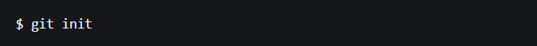
- sau khi khởi tạo có thể thấy thư mục **.git** được sinh ra trong folder vừa tạo:
  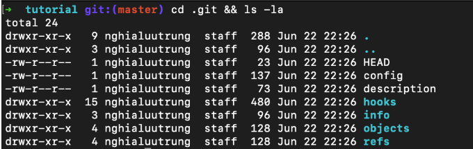
###### b. Remote Repository
- Là **repository** để chia sẻ giữa nhiều người và bố trí trên server chuyên dụng.
- Lúc này trên github của mình đã có remote repository là các file trong ảnh sau:
  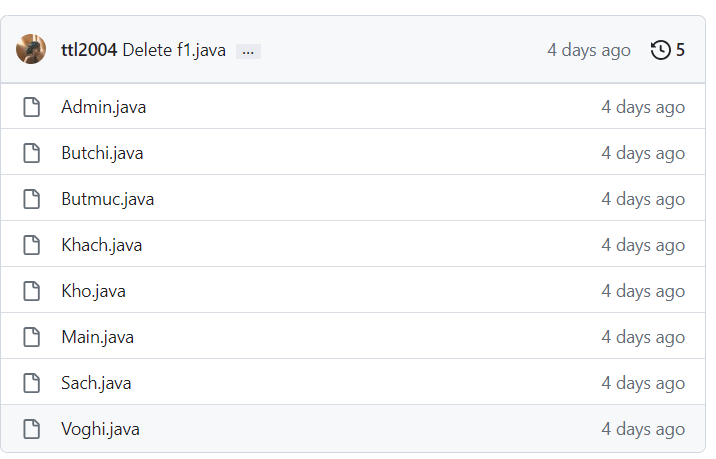
- Về cơ bản có thể hình dung như trong ảnh dưới về mối quan hệ giữa local repository và remote repository.
  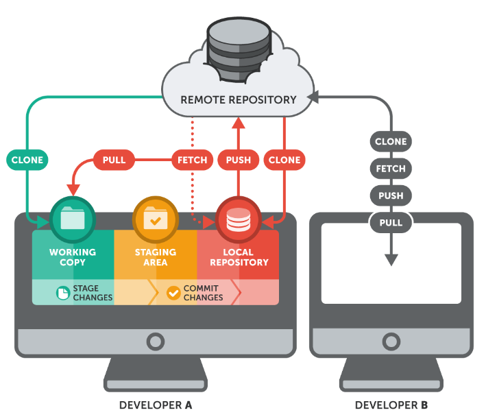
- Như ta thấy, trên máy tính của Developer A - một **local repository** dành cho Developer A thực hiện các thao tác với project sau đó được đồng bộ lên **Remote Repository** chung. Sau đó Developer B cũng có thể đồng bộ thông tin từ remote repo về local repo trên máy tình của Developer B.
###### c. Branch (Nhánh)
- Với Git, việc quản lý **branch - nhánh** rất dễ dàng. Mỗi nhánh trong Git gần giống như một workspace. Việc nhảy vào một nhánh để làm việc trong đó tương tự việc chuyển qua workspace mới và cũng có thể quay lại workspace cũ một cách nhanh chóng.
- Branch được dùng để phát triển tính năng mới mà không làm ảnh hưởng đến code hiện tại.
- Ví dụ:
  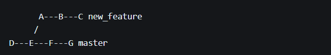
- Như trong ví dụ, _master_ là nhánh “mặc định” của repository. Khi thực hiện một tính năng mới để tránh ảnh hưởng đến code ở branch master, bạn tạo một nhánh mới là _new_feature_.
###### d. Commit
- Là thao tác để lưu lại trạng thái hiện tại trên hệ thống, ghi nhận lại lịch sử các xử lý: thêm, xóa, cập nhật các file hay thư mục trên repository
###### e. Merge
- Là hành động hợp nhất một nhánh phát triển vào nhánh khác hoặc hợp nhất lịch sử thay đổi khi pull hoặc push
- Ví dụ:
$-$ Trường hợp merge branch: bạn phát triển xong 1 tính năng, đã test/ kiểm thử các kiểu và thấy nó hoàn chỉnh, có thể tích hợp vào phần mềm thì bạn sẽ tiến hành merge code. Sau khi merge có thể giữ lại 1 trong 2 branch hoặc cả 2. Yêu cầu trước khi merge: phải push hết các commit lên branch.
###### f. Pull
- Là hành động cập nhật các thay đổi xuống local repo.
- Ví dụ: 
  $-$Trong khi bạn đang code trên một file thì một người bạn trong nhóm của bạn cũng code trên một file khác cùng branch, người bạn đó hoàn thành công việc, commit và push lên remote repo. Lúc này bạn muốn lấy những thay đổi mà người bạn của bạn đã thực hiện thì bạn sẽ thực hiện hành động Pull xuống.
###### g. Push
- Là hành động đưa những thay đổi đã commit lên một branch nào đó ở remote repository hoặc một branch mới hoàn toàn lên remote repository. Sau khi push lên thì các thành viên của team có thể thấy và đồng bộ code xuống máy local.
###### h. Clone
- Sao chép một **repository** có sẵn về local.
 _git clone /đường-dẫn-đến-repository/_
  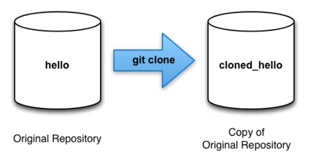
- Ví dụ:
  $-$Muốn lấy source code của dự án example-project từ remote repository đặt trên Github
  _$ git clone git@github.com:username/example-project.git_

  $-$Nếu repository nằm ở máy chủ khác thì bạn dùng lệnh sau:
  _git clone tênusername@địachỉmáychủ:/đường-dẫn-đến-repository_
###### i. Fork
-  Là hành động tạo một bản sao của repository gốc thành một repository của bạn. 
-  Việc fork một repository cho phép bạn dễ dàng chỉnh sửa, thay đổi source code mà không ảnh hưởng tới source gốc.
  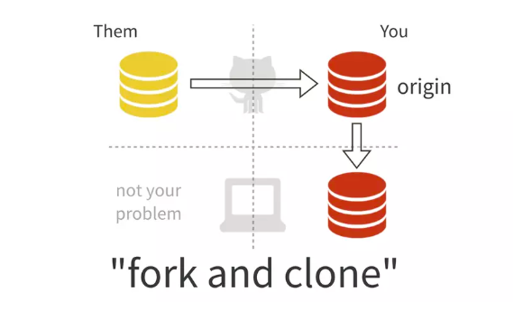
## 3. Pull Request
_Pull request hay gọi tắt viết tắt là PR_
###### a. Khái niệm
- Là một yêu cầu được tạo ra bởi một nhóm phát triển hoặc lập trình viên để đề xuất thay đổi từ một nhánh chính (thường là main hoặc master) sang một nhánh khác của dự án trên GitHub.
- Thông qua PR, người tạo yêu cầu có thể trình bày sự thay đổi, giải thích tại sao thay đổi đó cần thiết và cung cấp thông tin chi tiết về quá trình triển khai.
###### Cách tạo Pull Request trên GitHub
- Bước 1: Fork dự án gốc
    - Truy cập vào dự án gốc trên GitHub.
    - Nhấn vào nút “**Fork**” ở góc trên bên phải để sao chép dự án vào tài khoản của bạn.
- Bước 2: Clone dự án về máy
    - Truy cập vào repository đã fork trong tài khoản của bạn.
    - Sao chép URL của repository.
    - Mở Terminal và sử dụng lệnh `git clone` để clone dự án về máy.
- Bước 3: Tạo nhánh mới
    - Mở Terminal trong thư mục dự án đã clone.
    - Sử dụng lệnh `git checkout -b [tên_nhánh]` để tạo và chuyển đổi sang một nhánh mới.
- Bước 4: Thực hiện thay đổi
    - Mở dự án trong trình chỉnh sửa mã nguồn.
    - Thực hiện các thay đổi cần thiết và lưu lại.
- Bước 5: Commit và Push
    - Mở Terminal và sử dụng lệnh git add . để thêm các thay đổi vào danh sách commit.
    - Sử dụng lệnh `git commit -m "Mô tả commit"` để commit các thay đổi đã thêm.
    Sử dụng lệnh `git push origin [tên_nhánh]` để đẩy thay đổi lên repository của bạn trên GitHub.
- Bước 6: Tạo Pull Request
    - Truy cập vào repository của bạn trên GitHub.
    - Nhấn vào nút “**Compare & pull request**” bên cạnh tên nhánh của bạn.
    - Điền thông tin cần thiết, mô tả về Pull Request và nhấn “**Create Pull Request**“.
- Bước 7: Kiểm tra và xử lý yêu cầu chỉnh sửa
    - Nhóm quản lý dự án sẽ xem xét và thảo luận về Pull Request của bạn.
    - Nếu cần chỉnh sửa, bạn chỉ cần thêm commit vào nhánh đã tạo và Pull Request sẽ tự động cập nhật.
- Bước 8: Pull Request được chấp nhận và merge
    - Sau khi Pull Request đạt yêu cầu, nhóm quản lý sẽ chấp nhận và merge vào nhánh chính.
    - Code của bạn đã được hợp nhất vào dự án gốc.
## 4. UML
- UML là viết tắt của "_Unified Modeling Language_" (Ngôn ngữ mô hình hóa thống nhất). Đây là một ngôn ngữ đồ họa được sử dụng chủ yếu trong lĩnh vực phát triển phần mềm để mô tả, thiết kế và trình bày các phần mềm bằng cách sử dụng các biểu đồ và ký hiệu.
- UML bao gồm nhiều loại biểu đồ, như:

    - **Biểu đồ lớp (Class Diagram):** Mô tả các lớp trong hệ thống, các thuộc tính của chúng và các mối quan hệ giữa chúng.

    - **Biểu đồ Use Case (Use Case Diagram):** Định rõ các chức năng và hành vi của hệ thống từ góc độ người dùng.

   -  **Biểu đồ Tuần tự (Sequence Diagram):** Hiển thị dòng thời gian của các sự kiện xảy ra trong hệ thống, đặc biệt là các tương tác giữa các đối tượng.

    - **Biểu đồ Trạng thái (State Diagram):** Mô tả các trạng thái khác nhau mà một đối tượng có thể chuyển đến trong quá trình thực hiện.

    - **Biểu đồ Hoạt động (Activity Diagram):** Hiển thị các hoạt động và quy trình trong hệ thống.

    - **Biểu đồ Giao tiếp (Communication Diagram):** Tương tự như biểu đồ tuần tự, nhưng làm nổi bật các đối tượng tham gia trong một tương tác.

    - **Biểu đồ Gói (Package Diagram):** Mô tả cách các phần của hệ thống được tổ chức thành các gói.
- Lí do cần vẽ UML bao gồm:

    - **Hiểu rõ và Giao tiếp:** Giúp các thành viên trong nhóm dự án hiểu rõ hệ thống và giao tiếp hiệu quả với nhau về kiến trúc và thiết kế.

    - **Thiết kế Hệ thống:** UML giúp trong quá trình thiết kế hệ thống, giúp xác định các yếu tố quan trọng và tương tác giữa chúng.

    - **Tài liệu hóa:** UML cung cấp một phương tiện tốt để tạo tài liệu cho hệ thống, giúp người đọc hiểu được cấu trúc và hoạt động của phần mềm.

    - **Kiểm tra và Chấp nhận:** Dùng để kiểm tra rõ ràng, phân tích và xác nhận yêu cầu của khách hàng.

    - **Quản lý Dự án:** Cung cấp một cách hiệu quả để quản lý và theo dõi tiến độ của dự án.
## 5. Mô hình Class Diagram, Activity Diagram
##### a. Activity Diagram (Biểu đồ hoạt động)
###### Khái niệm:
- Biểu đồ hoạt động là biểu đồ mô tả các bước thực hiện, các hành động, các nút quyết định và điều kiện rẽ nhánh để điều khiển luồng thực hiện của hệ thống. 
- Đối với những luồng thực thi có nhiều tiến trình chạy song song thì biểu đồ hoạt động là sự lựa chọn tối ưu cho việc thể hiện. 
###### Các thành phần của biểu đồ hoạt động:
- Trạng thái khởi tạo hoặc điểm bắt đầu (Initial State or Start Point)

- Hoạt động hoặc trạng thái hoạt động (Activity or Action State)

  - Hoạt động và sự chuyển đổi hoạt động được ký hiệu và cách sử dụng hoàn toàn giống như trạng thái trong biểu đồ trạng thái đã nêu ở trên.

- Nút quyết định và rẽ nhánh
    - Nút rẽ nhánh trong biểu đồ hoạt động được kí hiệu bằng hình thoi màu trắng.
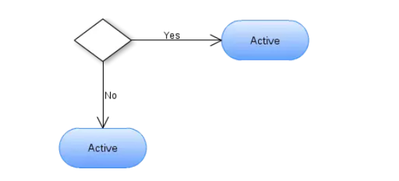

- Thanh tương tranh hay thanh đồng bộ
  - Có thể có nhiều luồng hành động được bắt đầu thực hiện hay kết thúc đồng thời trong hệ thống.

  - Thanh đồng bộ kết hợp:
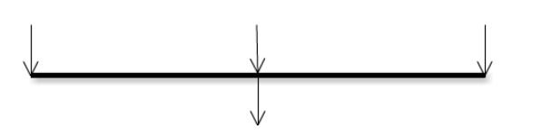

  - Thanh đồng bộ chia nhánh:
    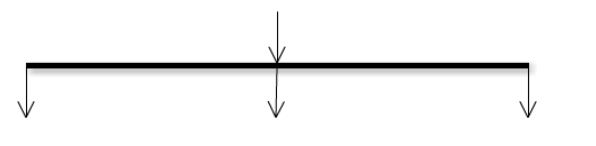
- Cạnh gián đoạn 
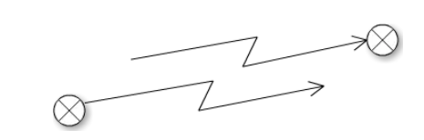
- Luồng hoạt động (Action Folow)

- Phân làn (Swimlanes)
    - Phân làn trong biểu đồ sử dụng là những đường nét đứt thẳng đứng theo các đối tượng. Phần kí hiệu này thường được sử dụng để làm rõ luồng hoạt động của các đối tượng riêng biệt.

- Thời gian sự kiện (Time Event)

- Gửi và nhận tín hiệu (Sent and Received Signals)
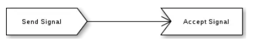

- Trạng thái kết thúc hoặc điểm cuối (Final State or End Point)

**Ví dụ:**

- Biểu đồ hoạt động rút tiền tại cây ATM:
 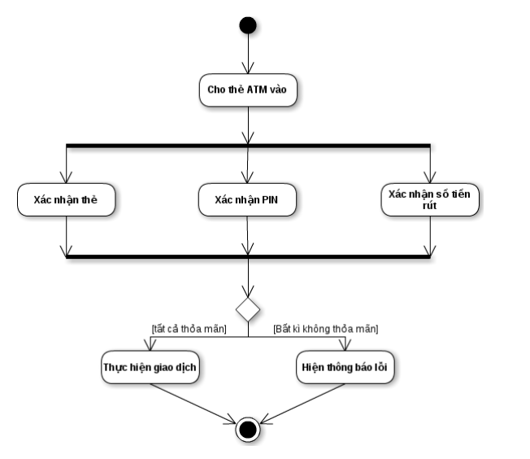

- Biểu đồ hoạt động thể hiện một qúa trình đặt hàng.
- 
  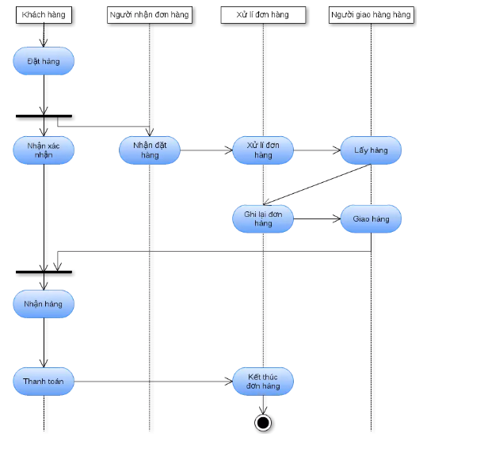
  
##### b. Class Diagram (Biểu đồ lớp)
###### Khái niệm:
- Class diagram mô tả kiểu của các đối tượng trong hệ thống và các loại quan hệ khác nhau tồn tại giữa chúng.
- Là một kỹ thuật mô hình hóa tồn tại ở tất cả các phương pháp phát triển hướng đối tượng.
- Biểu đồ hay dùng nhất trong UML và gần gũi nhất với các lập trình viên.
- Giúp các lập trình viên trao đổi với nhau và hiểu rõ ý tưởng của nhau.
######  Các tính chất cơ bản của class diagram
- Tên class
- Attribute (field, property)
- Operation (method, function)
- 
Ví dụ khai báo tên, attribute, operation kèm theo kiểu trả về của 1 class:
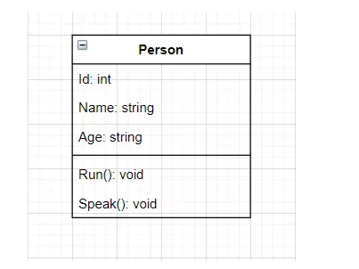
###### Access Modifier trong class diagram
- Sử dụng để đặc tả phạm vi truy cập cho các Attribute và Operation của 1 class (Cấp quyền cho các class khác sử dụng Attribute và Operation của class này).

- 4 lựa chọn phạm vi truy cập

    - Private ( - ): Chỉnh mình các đối tượng được tạo từ class này có thể sử dụng.
    - Public ( + ): Mọi đối tượng đều có thể sử dụng.
    - Protected ( # ): Chỉ các đối tượng được tạo từ class này và class kế thừa từ class này có thể sử dụng.
    - Package/Default: Các đối tượng được tạo từ class trong lớp cùng gói có thể sử dụng.
###### Mối quan hệ giữa các lớp
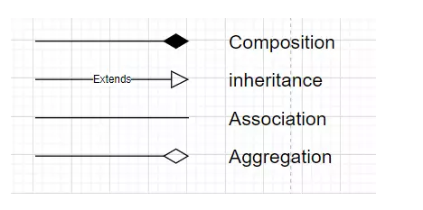
- Inheritance: 1 class kế thừa từ 1 class khác.
- Association: 2 class có liên hệ với nhau nhưng không chỉ rõ mối liên hệ.
- Composition: Đối tượng tạo từ lass A mất thì đối tượng tạo từ class B sẽ mất.
- Agreegation: Đối tượng tạo từ lass A mất thì đối tượng tạo từ class B vẫn tồn tại độc lập.
 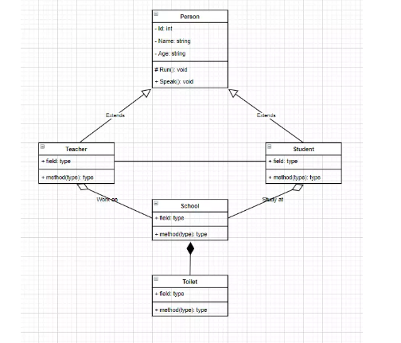
- Biểu diễn bội số quan hệ.
   - 1 : chính xác 1.
   - 0...1: 0 hoặc 1
   - n : Bắt buộc có n
   - 0...* : 0 hoặc nhiều
   - 1...* : 1 hoặc nhiều
   - m...n: có tối thiểu là m và tối đa là n
   - 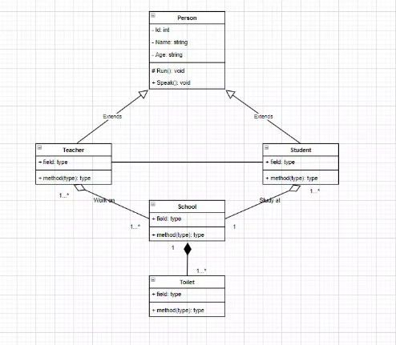